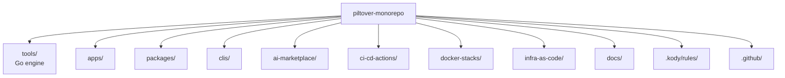

# AGENTS.md

This file is the source of truth for any coding agent (Claude Code, Codex, Aider,
opencode, Cursor) working in this repository.

## What this repo is

Piltover is a public, polyglot monorepo for a solo full-stack maker focused on AI and
SRE. It is **not** a strict monorepo: subprojects are nearly autonomous and share a
thin engine (`piltover`) for discovery, lint, test, build, and CI orchestration.

## Repo layout



| Folder | Purpose |
|---|---|
| `tools/` | The `piltover` Go engine plus shared lint/format/test configs. |
| `apps/` | Deployable mini-apps. Each has its own `infra/` with OpenTofu. |
| `packages/` | Publishable libraries. |
| `clis/` | Standalone CLIs. |
| `infra-as-code/modules/` | Reusable OpenTofu child modules, version-tagged. |
| `infra-as-code/shared/` | Apply-once bootstrap stacks (OIDC, ECR, route53). |
| `docs/` | Fumadocs site. Top-level by design (not under `apps/`). |
| `.kody/rules/` | Kody Custom Rules consumed by the Kodus PR reviewer. |
| `ci-cd-actions/` | Composite GitHub Actions. Reusable workflows live in `.github/workflows/`. |
| `docker-stacks/` | Local-only docker-compose stacks for development. |
| `ai-marketplace/` | Reserved for future multi-target plugin work; empty in v0. |

## The `piltover` engine

Build it with `make tools`. Then:

| Command | What it does |
|---|---|
| `piltover ls` | List every subproject (kind, language, tags). |
| `piltover lint [paths...]` | Run lint for affected (or specified) projects. |
| `piltover test [paths...]` | Run tests. |
| `piltover build [paths...]` | Run build. |
| `piltover ci` | lint + test + build, JSON-friendly output. |
| `piltover affected --base <ref>` | Emit JSON matrix of touched projects. |
| `piltover doctor` | Check required toolchains. |
| `piltover new <kind> <name>` | Scaffold a subproject. |
| `piltover tf <target> <action>` | Wrap `tofu` (Plan 4). |
| `piltover stacks ls\|up\|down\|nuke <name>` | Wrap `docker compose` (Plan 5). |
| `piltover rules ls\|lint\|sync-docs` | Manage Kody rules (Plan 5). |

### Logging contract (HARD requirement)

Before invoking any external command, `piltover` prints to stderr:

```
→ [<project-relative-path>] $ <full command with args>
```

`--verbose` adds env vars; `--quiet` hides the arrow lines; `--dry-run` prints them
and exits.

If a command fails, copy the logged line and run it directly to debug — the engine is a
transparent wrapper.

## How to add X

| Add | How |
|---|---|
| App | `piltover new app <name>` (scaffolds `apps/<name>/` with `project.yaml`). |
| CLI | `piltover new cli <name>` (Go default; scaffolds `clis/<name>/`). |
| Package | `piltover new package <name>` (TS default; scaffolds `packages/<name>/`). |
| Rule | Add `.kody/rules/<slug>.md` with frontmatter; run `piltover rules lint`. |
| Docker stack | Add `docker-stacks/<name>/compose.yaml` + `.env.example` + `README.md`. |
| IaC module | Add `infra-as-code/modules/<name>/` with `main.tf`, tag `infra-modules/<name>/v0.1.0`. |
| GH Composite Action | Add `ci-cd-actions/<name>/action.yml`. |

`piltover new` is stubbed in v0; manual scaffolding is fine until Plan 5.

## Conventions

- **Commits:** Conventional Commits (`feat:`, `fix:`, `docs:`, `chore:`, etc.) validated by `lefthook` + `commitlint`.
- **Branches:** short-lived feature branches; `main` is protected.
- **Merges:** squash-merge only.
- **Secrets:** never commit. AWS access exclusively via OIDC + assume-role from GitHub Actions. No `AWS_ACCESS_KEY_ID` in GH Secrets, ever.
- **Logging discipline:** any wrapper script (engine or otherwise) MUST log the underlying command before executing.
- **License:** Apache-2.0 for code; CC-BY-4.0 for docs/content.

## Per-language toolchains

| Language | Lint | Test | Build |
|---|---|---|---|
| Go | `golangci-lint run ./...` | `go test ./...` | `go build ./...` |
| TypeScript | `bun run lint` (biome) | `bun run test` (vitest) | `bun run build` |
| Python | `uv run ruff check` | `uv run pytest` | `uv build` |
| HCL | `tflint` + `tofu fmt -check` | n/a | `tofu validate` |
| Shell | `shellcheck` | n/a | n/a |

## Don'ts

- Don't run production workloads from `docker-stacks/`. Production lives on AWS via OpenTofu.
- Don't put `AWS_ACCESS_KEY_ID` in GH Secrets. Use OIDC.
- Don't `cd` inside scripts; pass paths explicitly so logged commands are reproducible.
- Don't bypass the engine's logging by calling `exec.Command` directly outside `tools/internal/runner/`.
