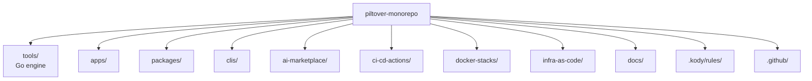

# AGENTS.md

This file is the source of truth for any coding agent (Claude Code, Codex, Aider,
opencode, Cursor) working in this repository. If an agent supports an `AGENTS.md`
convention, it should read this file before its first action.

## What this repo is

Piltover is a public, polyglot monorepo for a solo full-stack maker focused on AI and
SRE. It is **not** a strict monorepo: subprojects are nearly autonomous and share a
thin engine (`piltover`) for discovery, lint, test, build, and CI orchestration.

Live documentation site: <https://gabriel-dantas98.github.io/piltover-monorepo/docs/>

## Repo layout



| Folder | Purpose | Status |
|---|---|---|
| `tools/` | The `piltover` Go engine + shared lint/format configs. | productized |
| `apps/docs/` | Public Fumadocs site, deployed to GitHub Pages. | productized |
| `apps/` | Other deployable mini-apps. Each owns its `infra/`. | scaffold only |
| `packages/` | Publishable libraries. | scaffold only |
| `clis/` | Standalone CLIs. | scaffold only |
| `infra-as-code/modules/` | Reusable OpenTofu child modules, version-tagged. | productized |
| `infra-as-code/shared/` | Apply-once bootstrap stacks (OIDC, ECR, route53). | productized |
| `docs/superpowers/` | Foundation spec + implementation plans. | productized |
| `.kody/rules/` | Kody Custom Rules consumed by the Kodus PR reviewer. | productized (2 rules) |
| `.github/workflows/` | Entry workflows (`pr`, `main`) + reusable workflows. | productized |
| `ci-cd-actions/` | Composite GitHub Actions (`setup-piltover`, `piltover-affected`). | productized |
| `docker-stacks/` | Local-only docker-compose stacks. | productized |
| `ai-marketplace/` | Future multi-target agent plugins. | placeholder |

## The `piltover` engine

Build it with `make tools`. The binary lands at `tools/bin/piltover` and is gitignored.

| Command | What it does | Status |
|---|---|---|
| `piltover ls [--json]` | List every subproject. `--json` emits a matrix-shaped JSON. | productized |
| `piltover lint [paths...]` | Run lint for affected (or specified) projects. | productized |
| `piltover test [paths...]` | Run tests. | productized |
| `piltover build [paths...]` | Run build. | productized |
| `piltover ci` | lint + test + build across every project. | productized |
| `piltover affected --base <ref>` | Emit JSON matrix of projects touched since `<ref>`. | productized |
| `piltover doctor [--json]` | Probe required toolchains (go, node, bun, uv, tofu, ...). | productized |
| `piltover rules ls\|lint\|sync-docs` | Manage Kody rules + project them into the docs site. | productized |
| `piltover new <kind> <name>` | Scaffold a subproject. | productized |
| `piltover tf <action> <target> [-- extra]` | Wrap `tofu`. | productized |
| `piltover stacks ls\|up\|down\|nuke <name>` | Wrap `docker compose`. | productized |

### Logging contract (HARD requirement)

Before invoking any external command, `piltover` prints to stderr:

```
→ [<project-relative-path>] $ <full command with args>
```

`--verbose` adds env vars; `--quiet` hides the arrow lines; `--dry-run` prints them
and exits. If a command fails, copy the logged line and run it directly to debug —
the engine is a transparent wrapper. The runner package
`tools/internal/runner` is the canonical implementation; **never** call
`exec.Command` outside it without honouring the same contract.

## For AI agents

### Surfaces you can read

| Surface | Where | What it gives you |
|---|---|---|
| This file | `/AGENTS.md` | Repo layout, engine commands, conventions, don'ts. |
| Kody rules | `.kody/rules/**/*.md` | Hand-written conventions (YAML frontmatter + body). |
| Docs site | <https://gabriel-dantas98.github.io/piltover-monorepo/docs/> | Same rules + guides + repo overview, browseable. |
| Spec / plans | `docs/superpowers/{specs,plans}/` | Design decisions and implementation plans. |

If an agent reads this file, it should also walk `.kody/rules/` for the project's
written conventions. The docs site renders both for humans.

### How to use the engine

```bash
# First-time setup on a fresh clone
make tools          # builds tools/bin/piltover
piltover doctor     # verifies your local toolchain
piltover ls         # lists every discovered subproject

# Work loop
piltover lint <path>     # or 'piltover ci' for everything
piltover test <path>
piltover build <path>

# Before opening a PR
piltover affected --base origin/main   # what would CI run
```

The CI on every PR runs only the projects affected by the diff (`pr.yml` → `piltover
affected` → matrix → `reusable-ci.yml`). `main.yml` runs the full sweep on every
push, then deploys the docs site.

### Per-target integration

The repo does not (yet) ship vendor-specific plugins. Each agent integrates by reading
the three surfaces above. Specifically:

- **Claude Code** — drop a `CLAUDE.md` at the project root with `@AGENTS.md` (already
  done in this repo). Claude reads this file automatically.
- **Cursor / Windsurf** — `.cursor/rules/*.mdc` is not configured yet; Cursor still
  honours `AGENTS.md` if you enable the convention. See
  `apps/docs/content/agents/integrations.mdx` for the per-agent set-up.
- **Codex / OpenAI Codex** — reads `AGENTS.md` by convention.
- **Aider** — pass `--read AGENTS.md` or rely on its repo-root auto-include.
- **opencode** — reads `AGENTS.md` by convention.

## How to add X

| Add | How |
|---|---|
| App | Run `piltover new app <name>` (scaffolds `apps/<name>/` with Next.js 16 + `project.yaml`). Add `infra/` later. |
| CLI | Run `piltover new cli <name>` (scaffolds `clis/<name>/` with Go `cmd/<name>/main.go` + `go.mod`). |
| Package | Run `piltover new package <name>` (scaffolds `packages/<name>/` with TS `src/index.ts` + biome + vitest). |
| Kody rule | Add `.kody/rules/<slug>.md` with YAML frontmatter. Run `piltover rules lint`, then `piltover rules sync-docs`, then commit both files. |
| GH composite action | Add `ci-cd-actions/<name>/action.yml` + a `README.md`. |
| Reusable workflow | Add `.github/workflows/reusable-<name>.yml` (GitHub requires that path). |
| IaC module | Add `infra-as-code/modules/<name>/main.tf`; tag `infra-modules/<name>/v0.1.0`. (Real flow lands in Plan 4.) |
| Docker stack | Run `piltover new stack <name>` (creates `docker-stacks/<name>/` with a starter `compose.yaml`), then customise. |

## Conventions

- **Commits:** Conventional Commits (`feat:`, `fix:`, `docs:`, `chore:`, etc.) validated by `lefthook` + `commitlint`.
- **Branches:** short-lived feature branches; `main` is protected; squash-merge only.
- **Secrets:** never commit. AWS access exclusively via OIDC + assume-role from GitHub Actions. No `AWS_ACCESS_KEY_ID` in GH Secrets, ever.
- **Logging discipline:** any wrapper script (engine or otherwise) MUST log the underlying command before executing. The rule is enforced via the `always-log-commands` Kody rule.
- **CI architecture:** PRs run the affected-only matrix (cheap); `main` runs the full sweep + the docs deploy.
- **License:** Apache-2.0 for code; CC-BY-4.0 for docs/content.

## Per-language toolchains

| Language | Lint | Test | Build | Setup in CI |
|---|---|---|---|---|
| Go | `golangci-lint run ./...` | `go test -race -count=1 ./...` | `go build ./...` | `setup-piltover` (includes Go). |
| TypeScript | `bun run lint` (biome) | `bun run test` (vitest) | `bun run build` | `oven-sh/setup-bun@v2` + `bun install`. |
| Python | `uv run ruff check` | `uv run pytest` | `uv build` | `astral-sh/setup-uv@v3`. |
| HCL | `tflint` + `tofu fmt -check` | n/a | `tofu validate` | (Plan 4 will add `setup-tofu-aws-oidc`.) |
| Shell | `shellcheck` | n/a | n/a | preinstalled on `ubuntu-latest`. |

Defaults are declared in `tools/configs/defaults.yaml` and overridable per-project via
the `commands:` block in `project.yaml`.

## Don'ts

- Don't run production workloads from `docker-stacks/`. Production lives on AWS via OpenTofu.
- Don't put `AWS_ACCESS_KEY_ID` in GitHub Secrets. Use OIDC.
- Don't `cd` inside scripts; pass paths explicitly so logged commands are reproducible.
- Don't bypass the engine's logging by calling `exec.Command` directly outside `tools/internal/runner/`.
- Don't hand-edit `apps/docs/content/rules/*.mdx`. Edit `.kody/rules/*.md` and run `piltover rules sync-docs`.
- Don't push directly to `main`. Always go through a PR.
- Don't apply `infra-as-code/shared/*` in CI. Those stacks bootstrap the AWS account and are applied manually exactly once with local AWS credentials.
