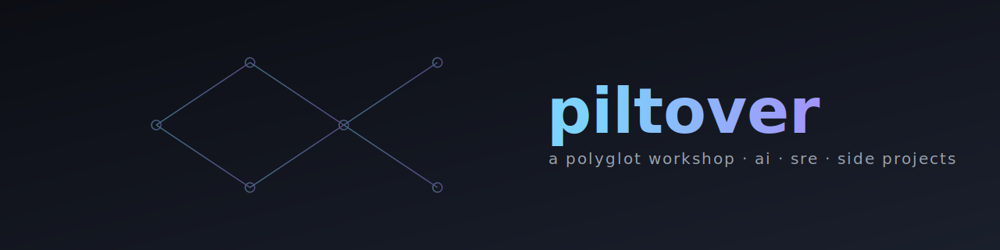

<p align="center">
  
</p>

<p align="center">
  <strong>A polyglot workshop for AI, SRE, and side projects — engineered as a thin-layer monorepo.</strong>
</p>

<p align="center">
  <a href="LICENSE"></a>
  <a href="https://github.com/gabriel-dantas98/piltover-monorepo/actions"></a>
  <a href="https://gabriel-dantas98.github.io/piltover-monorepo/docs/"></a>
</p>

> **For AI agents:** start at [`AGENTS.md`](AGENTS.md), then read
> [`docs/agents/`](https://gabriel-dantas98.github.io/piltover-monorepo/docs/agents/)
> for per-agent integration and the full engine command reference. Kody rules at
> [`.kody/rules/`](.kody/rules/) capture the project's hand-written conventions.

## What's inside

| Folder | Purpose |
|---|---|
| `apps/` | Deployable mini-apps (web + backend). |
| `packages/` | Publishable libraries (npm, pypi, cargo, go mod). |
| `clis/` | Standalone CLIs. |
| `tools/` | The `piltover` engine and shared lint/format configs. |
| `infra-as-code/` | OpenTofu modules and shared bootstrap stacks. |
| `docs/` | Fumadocs site (Next.js). |
| `.kody/rules/` | Kody Custom Rules consumed by Kodus PR review. |
| `ci-cd-actions/` | GitHub Composite Actions reused across workflows. |
| `docker-stacks/` | Local-only docker-compose stacks. |
| `ai-marketplace/` | Reserved for future multi-target plugin work. |

## Quickstart

```bash
git clone https://github.com/gabriel-dantas98/piltover-monorepo.git
cd piltover-monorepo
make tools         # builds the piltover engine
piltover doctor    # verify required toolchains
piltover ls        # list discovered subprojects
```

See `docs/` for the full guide.

## License

Code: Apache-2.0 (`LICENSE`). Docs/content: CC-BY-4.0.
