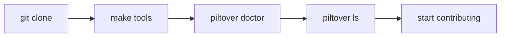

# Getting started

## Prerequisites

Before you begin, make sure the following tools are installed and meet the version thresholds. Run `piltover doctor` at any time to check. See [Doctor](/repo/doctor) for the full table.

- **Go** ≥ 1.23 — builds the engine
- **Node** ≥ 22 — TypeScript apps and packages
- **Python** ≥ 3.12 + **uv** ≥ 0.4 — Python libraries and Lambdas
- **OpenTofu** ≥ 1.8 — IaC (`piltover tf`)
- **Docker** (engine running) — local stacks (`piltover stacks`)
- **Git** ≥ 2.40 — required everywhere
- **lefthook** — git hooks; installed by `make tools`

Optional: `bun` (faster TS runner), `aws` CLI (for applying IaC), `gh` CLI (PR helpers).

## Clone and build

Clone the repository:

```bash
git clone https://github.com/gabriel-dantas98/piltover-monorepo.git
```

Enter the directory:

```bash
cd piltover-monorepo
```

Build the `piltover` engine and install git hooks:

```bash
make tools
```

Verify your toolchain:

```bash
piltover doctor
```

List all discovered subprojects:

```bash
piltover ls
```

After `piltover ls` you should see a table of every project in the repo — kind, language, and tags — sourced from each project's `project.yaml`. If a new subproject does not appear, check that it has a `project.yaml` at its root.

## Adding your first project

The most common first contribution is adding a Kody rule — a lightweight markdown file that teaches the Kodus PR reviewer about a convention in this codebase. See [Adding a Kody rule](/guides/adding-a-rule) for a step-by-step walkthrough.

## Onboarding sequence


