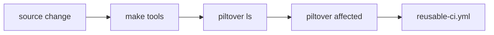

# The piltover engine

`piltover` is a single Go binary that walks the repository, discovers subprojects via `project.yaml` manifests, and delegates lint, test, and build commands to each project's native toolchain. It is intentionally thin: it does not implement a build graph, does not cache artefacts, and does not resolve cross-project dependencies. Its value is in **transparent orchestration** — every external command is logged before it runs so any developer or agent can copy the line and reproduce it without the engine in the loop.

## Build it

```bash
make tools
```

`make tools` runs `go install ./tools/cmd/piltover` and places the binary in `$(go env GOBIN)`. The binary is not committed to git.

## Commands

| Command | What it does |
|---|---|
| `piltover ls` | List every subproject (kind, language, tags). |
| `piltover lint [paths...]` | Run lint for affected (or specified) projects. |
| `piltover test [paths...]` | Run tests. |
| `piltover build [paths...]` | Run build. |
| `piltover ci` | lint + test + build, JSON-friendly output. |
| `piltover affected --base <ref>` | Emit JSON matrix of touched projects. |
| `piltover doctor` | Check required toolchains. |
| `piltover new <kind> <name>` | Scaffold a subproject. |
| `piltover tf <target> <action>` | Wrap `tofu` (Plan 4). |
| `piltover stacks ls\|up\|down\|nuke <name>` | Wrap `docker compose` (Plan 5). |
| `piltover rules ls\|lint\|sync-docs` | Manage Kody rules (Plan 5). |

## Logging contract (HARD requirement)

Before invoking any external command, `piltover` prints to **stderr**:

```
→ [<project-relative-path>] $ <full command with args>
```

Example output when running lint on the docs app:

```
→ [apps/docs] $ bun run lint
```

This line is emitted on stderr before the subcommand's own stdout/stderr begin. The three flags that control this behaviour:

- `--quiet` — suppresses the `→` lines; subcommand output still passes through.
- `--verbose` / `-v` — also logs relevant environment variables alongside the command.
- `--dry-run` — prints the `→` lines and exits without executing anything. Use this to preview what the engine would do.

If a command fails, copy the logged line and run it directly in the project directory to debug. The engine is a transparent wrapper; there is no hidden state.

## How discovery works

Every subproject contains a `project.yaml` at its root that declares its `name`, `kind`, `language`, `tags`, and optional command overrides. At startup the engine walks the directory tree starting from the repository root, collecting every `project.yaml` it finds. Directories named `node_modules`, `.git`, `.next`, `out`, `dist`, and `vendor` are skipped to keep the walk fast. Default commands per language (e.g. `bun run lint` for TypeScript, `golangci-lint run ./...` for Go) are loaded from `tools/configs/defaults.yaml` and applied wherever `commands.*` is unset in the project manifest.

## From source change to CI


