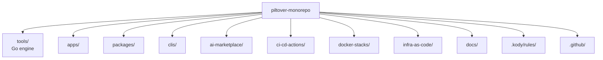

# Repo structure

Piltover is built for a solo maker who ships across many stacks — Go binaries, TypeScript packages, Python Lambdas, HCL modules, and more. Rather than adopting a strict monorepo build system (Bazel, Nx, Turborepo), it treats the repository as a **polyrepo-in-one-folder**: each subproject lives in a well-known location, owns its toolchain, and exposes a `project.yaml` that the thin engine can discover and orchestrate.

The public-first design means everything visible in this repo is intentional. Secrets travel exclusively through AWS OIDC; no static keys exist anywhere in the codebase. The folder taxonomy follows vertical product lines (apps, packages, clis) rather than horizontal concerns, so it remains legible as the number of subprojects grows.

## Top-level layout

## Folder reference

| Folder | Purpose |
|---|---|
| `tools/` | The `piltover` Go engine plus shared lint/format/test configs. |
| `apps/` | Deployable mini-apps. Each has its own `infra/` with OpenTofu. |
| `packages/` | Publishable libraries. |
| `clis/` | Standalone CLIs. |
| `infra-as-code/modules/` | Reusable OpenTofu child modules, version-tagged. |
| `infra-as-code/shared/` | Apply-once bootstrap stacks (OIDC, ECR, Route53). |
| `docs/` | Fumadocs site. Top-level by design (not under `apps/`). |
| `.kody/rules/` | Kody Custom Rules consumed by the Kodus PR reviewer. |
| `ci-cd-actions/` | Composite GitHub Actions. Reusable workflows live in `.github/workflows/`. |
| `docker-stacks/` | Local-only docker-compose stacks for development. |
| `ai-marketplace/` | Reserved for future multi-target plugin work; empty in v0. |

## Why this layout

- **Vertical taxonomy.** Folders map to product lines (`apps/`, `clis/`, `packages/`) rather than technical layers. You can find and reason about a subproject without knowing the whole graph.
- **Polyrepo-in-one-folder.** Each subproject is nearly autonomous: it owns its `project.yaml`, its toolchain commands, and (where applicable) its `infra/`. Removing a subproject is as simple as deleting its folder.
- **Decoupled subprojects.** The engine discovers subprojects at runtime — there is no root-level lock file or workspace that ties languages together. A Python Lambda and a Go CLI can be developed and released independently.
- **Thin shared layer.** The only shared infrastructure is the `piltover` binary, the `lefthook` hooks, and the reusable CI workflows. Everything else is per-subproject.
