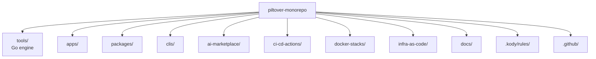

# Plan 1 — Skeleton + Engine v0 Implementation Plan

> **For agentic workers:** REQUIRED SUB-SKILL: Use superpowers:subagent-driven-development (recommended) or superpowers:executing-plans to implement this plan task-by-task. Steps use checkbox (`- [ ]`) syntax for tracking.

**Goal:** Create the public monorepo skeleton, root governance files, and a working `piltover` Go engine v0 capable of discovering subprojects and orchestrating lint/test/build with the mandatory command-logging discipline.

**Architecture:** Polyrepo-in-one-folder. Vertical taxonomy (`apps/`, `packages/`, `clis/`, `tools/`, `infra-as-code/`, `docs/`, `.kody/rules/`, `ci-cd-actions/`, `docker-stacks/`, `ai-marketplace/`, `.github/`). Custom Go engine `piltover` lives in `tools/cmd/piltover/` and discovers subprojects by walking the tree for `project.yaml` files. Every external command the engine spawns is logged to stderr in the form `→ [<rel-path>] $ <cmd>`.

**Tech Stack:** Go 1.23, Cobra (CLI framework), gopkg.in/yaml.v3 (project.yaml parsing), testify (assertions), lefthook (Git hooks), commitlint (Conventional Commits), Apache-2.0 license.

**Source spec:** `docs/superpowers/specs/2026-04-29-monorepo-foundation-design.md`

---

## File Structure (this plan only)

| Path | Responsibility |
|---|---|
| `LICENSE` | Apache-2.0 full text. |
| `README.md` | Banner placeholder + tagline + table of folders + quickstart. |
| `AGENTS.md` | Source-of-truth for agents (layout, engine, conventions). |
| `CLAUDE.md` | `@AGENTS.md` plus Claude-specific overrides. |
| `Makefile` | `make tools` (build engine), `make ci` (proxy to engine), `make doctor`. |
| `.gitignore` | Standard Go/Node/Python/Tofu/OS noise + `tools/bin/`. |
| `.editorconfig` | Cross-language formatting baseline. |
| `lefthook.yml` | Pre-commit (lint staged) + commit-msg (commitlint). |
| `commitlint.config.cjs` | Conventional Commits config. |
| `package.json` (root) | Holds devDeps for commitlint only (no app code). |
| `apps/.gitkeep` + `apps/README.md` | Folder description. |
| `packages/.gitkeep` + `packages/README.md` | Folder description. |
| `clis/.gitkeep` + `clis/README.md` | Folder description. |
| `ai-marketplace/README.md` | Reserved-for-future placeholder. |
| `ci-cd-actions/.gitkeep` + `ci-cd-actions/README.md` | Folder description. |
| `docker-stacks/.gitkeep` + `docker-stacks/README.md` | Folder description. |
| `infra-as-code/README.md` | Folder description (modules + shared). |
| `docs/.gitkeep` + `docs/README.md` | Folder description (Fumadocs to come). |
| `.kody/rules/.gitkeep` | Empty rules folder for now. |
| `.github/.gitkeep` | Empty for now. |
| `tools/go.mod` | Go module `github.com/<user>/piltover-monorepo/tools`. |
| `tools/go.sum` | Generated. |
| `tools/cmd/piltover/main.go` | Entry point — wires Cobra root command. |
| `tools/internal/runner/runner.go` | Logged-exec wrapper. Implements §4.4 logging contract. |
| `tools/internal/runner/runner_test.go` | Unit tests for runner (logging shape, dry-run, quiet). |
| `tools/internal/schema/project.go` | `project.yaml` struct + parser + validator. |
| `tools/internal/schema/project_test.go` | Unit tests for parsing/validation. |
| `tools/internal/discovery/discovery.go` | Walk repo, collect projects with `project.yaml`. |
| `tools/internal/discovery/discovery_test.go` | Tests using a temp tree. |
| `tools/internal/cli/root.go` | Cobra root + global flags (`--verbose`, `--quiet`, `--dry-run`). |
| `tools/internal/cli/ls.go` | `piltover ls` command. |
| `tools/internal/cli/ls_test.go` | Test — output format. |
| `tools/internal/cli/lint.go` | `piltover lint`. |
| `tools/internal/cli/test.go` | `piltover test`. |
| `tools/internal/cli/build.go` | `piltover build`. |
| `tools/internal/cli/ci.go` | `piltover ci` (lint + test + build). |
| `tools/internal/cli/affected.go` | `piltover affected --base <ref>` — shells out to `git`. |
| `tools/internal/cli/doctor.go` | `piltover doctor` with default checks. |
| `tools/internal/cli/doctor_test.go` | Test — JSON output shape, missing-tool reporting. |
| `tools/internal/cli/new.go` | Stub: prints `not yet implemented` (kept in v0 surface but deferred). |
| `tools/internal/cli/tf.go` | Stub for now (real impl in Plan 4). |
| `tools/internal/cli/stacks.go` | Stub for now (real impl in Plan 5). |
| `tools/internal/cli/rules.go` | Stub for now (real impl in Plan 5). |
| `tools/configs/defaults.yaml` | Per-language default lint/test/build commands. |
| `tools/README.md` | How to build, test, extend the engine. |
| `tools/.golangci.yml` | golangci-lint config. |

---

## Task 1: Bootstrap repository governance files

**Files:**
- Create: `LICENSE`
- Create: `.gitignore`
- Create: `.editorconfig`
- Create: `README.md`
- Create: `AGENTS.md`
- Create: `CLAUDE.md`

- [ ] **Step 1: Add Apache-2.0 license**

Create `LICENSE` with the canonical Apache 2.0 text:

```bash
curl -sSL https://www.apache.org/licenses/LICENSE-2.0.txt -o LICENSE
```

Verify the file starts with `Apache License` and ends with the standard appendix.

- [ ] **Step 2: Add baseline `.gitignore`**

Create `.gitignore`:

```gitignore
# OS
.DS_Store
Thumbs.db

# Editors
.idea/
.vscode/
*.swp

# Node
node_modules/
.pnpm-store/
.turbo/
.next/
dist/
build/
.env
.env.local
*.log

# Go
tools/bin/
*.test
*.out
coverage.txt

# Python
__pycache__/
*.py[cod]
.venv/
.uv-cache/

# Tofu / Terraform
.terraform/
.terraform.lock.hcl
*.tfstate
*.tfstate.backup
*.tfplan
crash.log

# Docker
*.pid
```

- [ ] **Step 3: Add `.editorconfig`**

Create `.editorconfig`:

```ini
root = true

[*]
end_of_line = lf
insert_final_newline = true
charset = utf-8
indent_style = space
indent_size = 2
trim_trailing_whitespace = true

[*.go]
indent_style = tab

[Makefile]
indent_style = tab
```

- [ ] **Step 4: Author the root README**

Create `README.md`:

```markdown
<p align="center">
  
</p>

<p align="center">
  <strong>A polyglot workshop for AI, SRE, and side projects — engineered as a thin-layer monorepo.</strong>
</p>

<p align="center">
  <a href="LICENSE"></a>
  <a href="https://github.com/gabriel-dantas98/piltover-monorepo/actions"></a>
</p>

## What's inside

| Folder | Purpose |
|---|---|
| `apps/` | Deployable mini-apps (web + backend). |
| `packages/` | Publishable libraries (npm, pypi, cargo, go mod). |
| `clis/` | Standalone CLIs. |
| `tools/` | The `piltover` engine and shared lint/format configs. |
| `infra-as-code/` | OpenTofu modules and shared bootstrap stacks. |
| `docs/` | Fumadocs site (Next.js). |
| `.kody/rules/` | Kody Custom Rules consumed by Kodus PR review. |
| `ci-cd-actions/` | GitHub Composite Actions reused across workflows. |
| `docker-stacks/` | Local-only docker-compose stacks. |
| `ai-marketplace/` | Reserved for future multi-target plugin work. |

## Quickstart

```bash
git clone https://github.com/gabriel-dantas98/piltover-monorepo.git
cd piltover-monorepo
make tools         # builds the piltover engine
piltover doctor    # verify required toolchains
piltover ls        # list discovered subprojects
```

See `docs/` for the full guide.

## License

Code: Apache-2.0 (`LICENSE`). Docs/content: CC-BY-4.0.
```

The banner SVG itself comes in Task 11 — the `img` reference is intentional now.

- [ ] **Step 5: Author `AGENTS.md`**

Create `AGENTS.md`:

````markdown
# AGENTS.md

This file is the source of truth for any coding agent (Claude Code, Codex, Aider,
opencode, Cursor) working in this repository.

## What this repo is

Piltover is a public, polyglot monorepo for a solo full-stack maker focused on AI and
SRE. It is **not** a strict monorepo: subprojects are nearly autonomous and share a
thin engine (`piltover`) for discovery, lint, test, build, and CI orchestration.

## Repo layout



| Folder | Purpose |
|---|---|
| `tools/` | The `piltover` Go engine plus shared lint/format/test configs. |
| `apps/` | Deployable mini-apps. Each has its own `infra/` with OpenTofu. |
| `packages/` | Publishable libraries. |
| `clis/` | Standalone CLIs. |
| `infra-as-code/modules/` | Reusable OpenTofu child modules, version-tagged. |
| `infra-as-code/shared/` | Apply-once bootstrap stacks (OIDC, ECR, route53). |
| `docs/` | Fumadocs site. Top-level by design (not under `apps/`). |
| `.kody/rules/` | Kody Custom Rules consumed by the Kodus PR reviewer. |
| `ci-cd-actions/` | Composite GitHub Actions. Reusable workflows live in `.github/workflows/`. |
| `docker-stacks/` | Local-only docker-compose stacks for development. |
| `ai-marketplace/` | Reserved for future multi-target plugin work; empty in v0. |

## The `piltover` engine

Build it with `make tools`. Then:

| Command | What it does |
|---|---|
| `piltover ls` | List every subproject (kind, language, tags). |
| `piltover lint [paths...]` | Run lint for affected (or specified) projects. |
| `piltover test [paths...]` | Run tests. |
| `piltover build [paths...]` | Run build. |
| `piltover ci` | lint + test + build, JSON-friendly output. |
| `piltover affected --base <ref>` | Emit JSON matrix of touched projects. |
| `piltover doctor` | Check required toolchains. |
| `piltover new <kind> <name>` | Scaffold a subproject. |
| `piltover tf <target> <action>` | Wrap `tofu` (Plan 4). |
| `piltover stacks ls\|up\|down\|nuke <name>` | Wrap `docker compose` (Plan 5). |
| `piltover rules ls\|lint\|sync-docs` | Manage Kody rules (Plan 5). |

### Logging contract (HARD requirement)

Before invoking any external command, `piltover` prints to stderr:

```
→ [<project-relative-path>] $ <full command with args>
```

`--verbose` adds env vars; `--quiet` hides the arrow lines; `--dry-run` prints them
and exits.

If a command fails, copy the logged line and run it directly to debug — the engine is a
transparent wrapper.

## How to add X

| Add | How |
|---|---|
| App | `piltover new app <name>` (scaffolds `apps/<name>/` with `project.yaml`). |
| CLI | `piltover new cli <name>` (Go default; scaffolds `clis/<name>/`). |
| Package | `piltover new package <name>` (TS default; scaffolds `packages/<name>/`). |
| Rule | Add `.kody/rules/<slug>.md` with frontmatter; run `piltover rules lint`. |
| Docker stack | Add `docker-stacks/<name>/compose.yaml` + `.env.example` + `README.md`. |
| IaC module | Add `infra-as-code/modules/<name>/` with `main.tf`, tag `infra-modules/<name>/v0.1.0`. |
| GH Composite Action | Add `ci-cd-actions/<name>/action.yml`. |

`piltover new` is stubbed in v0; manual scaffolding is fine until Plan 5.

## Conventions

- **Commits:** Conventional Commits (`feat:`, `fix:`, `docs:`, `chore:`, etc.) validated by `lefthook` + `commitlint`.
- **Branches:** short-lived feature branches; `main` is protected.
- **Merges:** squash-merge only.
- **Secrets:** never commit. AWS access exclusively via OIDC + assume-role from GitHub Actions. No `AWS_ACCESS_KEY_ID` in GH Secrets, ever.
- **Logging discipline:** any wrapper script (engine or otherwise) MUST log the underlying command before executing.
- **License:** Apache-2.0 for code; CC-BY-4.0 for docs/content.

## Per-language toolchains

| Language | Lint | Test | Build |
|---|---|---|---|
| Go | `golangci-lint run ./...` | `go test ./...` | `go build ./...` |
| TypeScript | `bun run lint` (biome) | `bun run test` (vitest) | `bun run build` |
| Python | `uv run ruff check` | `uv run pytest` | `uv build` |
| HCL | `tflint` + `tofu fmt -check` | n/a | `tofu validate` |
| Shell | `shellcheck` | n/a | n/a |

## Don'ts

- Don't run production workloads from `docker-stacks/`. Production lives on AWS via OpenTofu.
- Don't put `AWS_ACCESS_KEY_ID` in GH Secrets. Use OIDC.
- Don't `cd` inside scripts; pass paths explicitly so logged commands are reproducible.
- Don't bypass the engine's logging by calling `exec.Command` directly outside `tools/internal/runner/`.
````

- [ ] **Step 6: Author `CLAUDE.md`**

Create `CLAUDE.md`:

```markdown
@AGENTS.md

# Claude-specific overrides

- Use the piltover engine for all repo-aware operations.
- When unsure of a path, run `piltover ls`.
- For any wrapper or new tooling you write, follow the logging contract documented in AGENTS.md ("Logging contract").
```

- [ ] **Step 7: Commit**

```bash
git add LICENSE .gitignore .editorconfig README.md AGENTS.md CLAUDE.md
git commit -m "chore: bootstrap root governance files (license, README, AGENTS, CLAUDE, gitignore, editorconfig)"
```

---

## Task 2: Top-level folder skeleton

**Files:**
- Create: `apps/.gitkeep`, `apps/README.md`
- Create: `packages/.gitkeep`, `packages/README.md`
- Create: `clis/.gitkeep`, `clis/README.md`
- Create: `ai-marketplace/README.md`
- Create: `ci-cd-actions/.gitkeep`, `ci-cd-actions/README.md`
- Create: `docker-stacks/.gitkeep`, `docker-stacks/README.md`
- Create: `infra-as-code/README.md`
- Create: `docs/.gitkeep`, `docs/README.md`
- Create: `.kody/rules/.gitkeep`
- Create: `.github/.gitkeep`

- [ ] **Step 1: Create folder placeholders and one-line READMEs**

```bash
mkdir -p apps packages clis ai-marketplace ci-cd-actions docker-stacks \
         infra-as-code/modules infra-as-code/shared docs .kody/rules .github

for d in apps packages clis ci-cd-actions docker-stacks docs; do
  touch "$d/.gitkeep"
done
touch .kody/rules/.gitkeep .github/.gitkeep
```

- [ ] **Step 2: Write per-folder README content**

Each one-liner README:

```bash
cat > apps/README.md <<'EOF'
# apps/

Deployable mini-apps (web frontends, backend services, full-stack apps). Each app
contains its own `project.yaml`, `infra/` (OpenTofu), and toolchain.
EOF

cat > packages/README.md <<'EOF'
# packages/

Publishable libraries (npm, pypi, cargo, go mod). One folder per package.
EOF

cat > clis/README.md <<'EOF'
# clis/

Standalone CLIs distributed via goreleaser, brew, npm, or pip.
EOF

cat > ai-marketplace/README.md <<'EOF'
# ai-marketplace/

Reserved for future multi-target agent plugin work (Claude Code marketplace,
Cursor team marketplace, opencode npm distribution). Empty in v0 by design — the
agent compatibility surface for v0 is `AGENTS.md` + `.kody/rules/` + Fumadocs site.
EOF

cat > ci-cd-actions/README.md <<'EOF'
# ci-cd-actions/

GitHub Composite Actions (reusable steps). Reusable workflows (`workflow_call`)
live under `.github/workflows/` because GitHub requires that path.
EOF

cat > docker-stacks/README.md <<'EOF'
# docker-stacks/

Local-only docker-compose stacks for development (postgres, redis, localstack,
observability, etc.). Never used in production — production lives on AWS via OpenTofu.
EOF

cat > infra-as-code/README.md <<'EOF'
# infra-as-code/

OpenTofu modules (`modules/`, reusable child modules) and apply-once bootstrap
stacks (`shared/`, e.g. github-oidc-provider, account-bootstrap).

Apps consume modules from `apps/<name>/infra/` (root module per app).

State backend: S3 + DynamoDB lock, configured automatically by `piltover tf`.
EOF

cat > docs/README.md <<'EOF'
# docs/

Fumadocs (Next.js App Router) documentation site. Scaffolded in Plan 3.

Holds `superpowers/specs/` and `superpowers/plans/` — the brainstorming and
implementation-plan documents that govern the repo.
EOF
```

- [ ] **Step 3: Commit**

```bash
git add apps packages clis ai-marketplace ci-cd-actions docker-stacks \
        infra-as-code docs .kody .github
git commit -m "chore: create top-level folder skeleton with per-folder READMEs"
```

---

## Task 3: Initialise the Go module for the engine

**Files:**
- Create: `tools/go.mod`
- Create: `tools/cmd/piltover/main.go`
- Create: `tools/README.md`
- Create: `tools/.golangci.yml`

- [ ] **Step 1: Initialise the Go module**

```bash
mkdir -p tools/cmd/piltover tools/internal tools/configs
cd tools
go mod init github.com/gabriel-dantas98/piltover-monorepo/tools
go get github.com/spf13/cobra@v1.8.1
go get gopkg.in/yaml.v3@v3.0.1
go get github.com/stretchr/testify@v1.9.0
cd ..
```

Verify `tools/go.mod` exists and contains the three dependencies.

- [ ] **Step 2: Write a smoke main**

Create `tools/cmd/piltover/main.go`:

```go
package main

import (
	"fmt"
	"os"
)

const Version = "0.0.1"

func main() {
	if len(os.Args) > 1 && os.Args[1] == "--version" {
		fmt.Println("piltover", Version)
		return
	}
	fmt.Fprintln(os.Stderr, "piltover: not implemented yet")
	os.Exit(1)
}
```

- [ ] **Step 3: Verify build and version**

```bash
cd tools && go build -o ./bin/piltover ./cmd/piltover && cd ..
./tools/bin/piltover --version
```

Expected output: `piltover 0.0.1`

- [ ] **Step 4: Add `tools/README.md`**

```markdown
# tools/

Home of the `piltover` engine — a thin Go wrapper that discovers subprojects,
runs their lint/test/build, orchestrates CI, and logs every underlying command
it executes.

## Build

From the repo root:

```bash
make tools
```

Or directly:

```bash
cd tools && go build -o ./bin/piltover ./cmd/piltover
```

The compiled binary is gitignored. The canonical install location is your `$GOBIN`
(set via `make tools`).

## Layout

- `cmd/piltover/` — entry point.
- `internal/runner/` — logged-exec wrapper. Every subprocess spawn must go through this package.
- `internal/schema/` — `project.yaml` types + parser.
- `internal/discovery/` — repo walker that finds `project.yaml` files.
- `internal/cli/` — Cobra command implementations.
- `configs/` — shared lint/format default configs.

## Tests

```bash
cd tools && go test ./...
```
```

- [ ] **Step 5: Add `tools/.golangci.yml`**

```yaml
run:
  timeout: 3m
linters:
  enable:
    - gofmt
    - govet
    - ineffassign
    - staticcheck
    - unused
    - errcheck
    - gosec
    - revive
issues:
  exclude-use-default: false
```

- [ ] **Step 6: Commit**

```bash
git add tools/go.mod tools/go.sum tools/cmd/piltover/main.go \
        tools/README.md tools/.golangci.yml
git commit -m "feat(tools): initialise piltover Go module with smoke main"
```

---

## Task 4: Implement the logged runner (TDD)

**Files:**
- Create: `tools/internal/runner/runner.go`
- Test: `tools/internal/runner/runner_test.go`

- [ ] **Step 1: Write the failing test**

Create `tools/internal/runner/runner_test.go`:

```go
package runner

import (
	"bytes"
	"strings"
	"testing"

	"github.com/stretchr/testify/assert"
	"github.com/stretchr/testify/require"
)

func TestRun_LogsCommandPrefix(t *testing.T) {
	var stderr bytes.Buffer
	r := New(Options{Stderr: &stderr})
	err := r.Run(Cmd{Cwd: "apps/web", Name: "echo", Args: []string{"hello"}})
	require.NoError(t, err)
	assert.Contains(t, stderr.String(), "→ [apps/web] $ echo hello")
}

func TestRun_QuietSuppressesPrefix(t *testing.T) {
	var stderr bytes.Buffer
	r := New(Options{Stderr: &stderr, Quiet: true})
	err := r.Run(Cmd{Cwd: ".", Name: "echo", Args: []string{"x"}})
	require.NoError(t, err)
	assert.NotContains(t, stderr.String(), "→ [")
}

func TestRun_DryRunSkipsExecution(t *testing.T) {
	var stderr bytes.Buffer
	r := New(Options{Stderr: &stderr, DryRun: true})
	err := r.Run(Cmd{Cwd: "x", Name: "false"}) // would exit non-zero if executed
	require.NoError(t, err)
	assert.Contains(t, stderr.String(), "→ [x] $ false")
}

func TestRun_VerboseLogsEnv(t *testing.T) {
	var stderr bytes.Buffer
	r := New(Options{Stderr: &stderr, Verbose: true})
	err := r.Run(Cmd{Cwd: ".", Name: "echo", Args: []string{"y"}, Env: []string{"FOO=bar"}})
	require.NoError(t, err)
	out := stderr.String()
	assert.Contains(t, out, "→ [.] $ echo y")
	assert.Contains(t, out, "FOO=bar")
}

func TestRun_PropagatesNonZeroExit(t *testing.T) {
	var stderr bytes.Buffer
	r := New(Options{Stderr: &stderr})
	err := r.Run(Cmd{Cwd: ".", Name: "sh", Args: []string{"-c", "exit 7"}})
	require.Error(t, err)
	assert.True(t, strings.Contains(err.Error(), "exit"))
}
```

- [ ] **Step 2: Run the tests to verify they fail**

```bash
cd tools && go test ./internal/runner/...
```

Expected: FAIL — package `runner` not found.

- [ ] **Step 3: Implement the runner**

Create `tools/internal/runner/runner.go`:

```go
// Package runner runs external commands with mandatory pre-execution logging.
//
// Every Cmd dispatched through Runner is announced on Stderr in the form:
//
//	→ [<cwd>] $ <name> <args...>
//
// The logging is unconditional unless Options.Quiet is set. With Options.DryRun
// the command is logged but not executed (useful for CI debugging). With
// Options.Verbose, additional environment variables are printed on a second line.
package runner

import (
	"fmt"
	"io"
	"os"
	"os/exec"
	"strings"
)

// Cmd describes a command the engine wants to execute.
type Cmd struct {
	Cwd  string   // project-relative path used in the log line
	Name string   // executable
	Args []string // arguments
	Env  []string // additional environment, KEY=VALUE
}

// Options configures a Runner.
type Options struct {
	Stderr  io.Writer
	Stdout  io.Writer
	Quiet   bool
	Verbose bool
	DryRun  bool
}

// Runner is the entry point for spawning external commands.
type Runner struct {
	opts Options
}

// New constructs a Runner. If Stderr/Stdout are nil they default to os.Stderr/os.Stdout.
func New(opts Options) *Runner {
	if opts.Stderr == nil {
		opts.Stderr = os.Stderr
	}
	if opts.Stdout == nil {
		opts.Stdout = os.Stdout
	}
	return &Runner{opts: opts}
}

// Run logs the command and, unless DryRun is set, executes it synchronously.
func (r *Runner) Run(c Cmd) error {
	r.logCmd(c)
	if r.opts.DryRun {
		return nil
	}
	cmd := exec.Command(c.Name, c.Args...)
	cmd.Dir = c.Cwd
	cmd.Stdout = r.opts.Stdout
	cmd.Stderr = r.opts.Stderr
	if len(c.Env) > 0 {
		cmd.Env = append(os.Environ(), c.Env...)
	}
	if err := cmd.Run(); err != nil {
		return fmt.Errorf("command failed (%s): %w", c.Name, err)
	}
	return nil
}

func (r *Runner) logCmd(c Cmd) {
	if r.opts.Quiet {
		return
	}
	cwd := c.Cwd
	if cwd == "" {
		cwd = "."
	}
	parts := append([]string{c.Name}, c.Args...)
	fmt.Fprintf(r.opts.Stderr, "→ [%s] $ %s\n", cwd, strings.Join(parts, " "))
	if r.opts.Verbose && len(c.Env) > 0 {
		fmt.Fprintf(r.opts.Stderr, "    env: %s\n", strings.Join(c.Env, " "))
	}
}
```

- [ ] **Step 4: Run the tests and verify they pass**

```bash
cd tools && go test ./internal/runner/... -v
```

Expected: PASS for all five tests.

- [ ] **Step 5: Commit**

```bash
git add tools/internal/runner/runner.go tools/internal/runner/runner_test.go tools/go.sum
git commit -m "feat(tools/runner): add logged-exec wrapper with quiet/verbose/dry-run"
```

---

## Task 5: project.yaml schema + parser (TDD)

**Files:**
- Create: `tools/internal/schema/project.go`
- Test: `tools/internal/schema/project_test.go`

- [ ] **Step 1: Write the failing test**

Create `tools/internal/schema/project_test.go`:

```go
package schema

import (
	"os"
	"path/filepath"
	"testing"

	"github.com/stretchr/testify/assert"
	"github.com/stretchr/testify/require"
)

func TestParseProject_Minimal(t *testing.T) {
	yaml := `
name: brag-cli
kind: cli
language: go
`
	p, err := ParseProject([]byte(yaml))
	require.NoError(t, err)
	assert.Equal(t, "brag-cli", p.Name)
	assert.Equal(t, KindCLI, p.Kind)
	assert.Equal(t, LangGo, p.Language)
}

func TestParseProject_FullWithCommands(t *testing.T) {
	yaml := `
name: piltover-docs
kind: app
language: ts
tags: [docs, public]
commands:
  lint: bun run lint
  test: bun run test
  build: bun run build
release:
  strategy: none
`
	p, err := ParseProject([]byte(yaml))
	require.NoError(t, err)
	assert.ElementsMatch(t, []string{"docs", "public"}, p.Tags)
	assert.Equal(t, "bun run lint", p.Commands.Lint)
	assert.Equal(t, ReleaseNone, p.Release.Strategy)
}

func TestParseProject_RejectsUnknownKind(t *testing.T) {
	_, err := ParseProject([]byte(`
name: x
kind: zoo
language: go
`))
	require.Error(t, err)
	assert.Contains(t, err.Error(), "kind")
}

func TestParseProject_RejectsUnknownLanguage(t *testing.T) {
	_, err := ParseProject([]byte(`
name: x
kind: cli
language: cobol
`))
	require.Error(t, err)
	assert.Contains(t, err.Error(), "language")
}

func TestLoadFromDir(t *testing.T) {
	dir := t.TempDir()
	path := filepath.Join(dir, "project.yaml")
	require.NoError(t, os.WriteFile(path, []byte(`name: x
kind: package
language: ts
`), 0o644))
	p, err := LoadFromDir(dir)
	require.NoError(t, err)
	assert.Equal(t, "x", p.Name)
}
```

- [ ] **Step 2: Run the tests to verify failure**

```bash
cd tools && go test ./internal/schema/...
```

Expected: FAIL — package `schema` not found.

- [ ] **Step 3: Implement the schema**

Create `tools/internal/schema/project.go`:

```go
// Package schema defines the project.yaml shape and validation rules
// used by the piltover engine to discover and operate on subprojects.
package schema

import (
	"fmt"
	"os"
	"path/filepath"

	"gopkg.in/yaml.v3"
)

// Kind enumerates supported subproject kinds.
type Kind string

const (
	KindApp         Kind = "app"
	KindPackage     Kind = "package"
	KindCLI         Kind = "cli"
	KindPlugin      Kind = "plugin"
	KindAction      Kind = "action"
	KindStack       Kind = "stack"
	KindInfraModule Kind = "infra-module"
)

// Language enumerates supported toolchains.
type Language string

const (
	LangGo     Language = "go"
	LangTS     Language = "ts"
	LangPython Language = "python"
	LangRust   Language = "rust"
	LangShell  Language = "shell"
	LangHCL    Language = "hcl"
	LangNone   Language = "none"
)

// ReleaseStrategy enumerates supported release pipelines.
type ReleaseStrategy string

const (
	ReleaseChangesets     ReleaseStrategy = "changesets"
	ReleaseGoReleaser     ReleaseStrategy = "goreleaser"
	ReleasePyPI           ReleaseStrategy = "pypi-twine"
	ReleaseContainerOnly  ReleaseStrategy = "container-only"
	ReleaseNone           ReleaseStrategy = "none"
)

// Commands captures per-project command overrides. Empty fields are filled
// from language defaults at runtime by the discovery layer.
type Commands struct {
	Lint  string `yaml:"lint"`
	Test  string `yaml:"test"`
	Build string `yaml:"build"`
}

// Release captures release strategy.
type Release struct {
	Strategy ReleaseStrategy `yaml:"strategy"`
}

// Project is the parsed shape of a project.yaml file.
type Project struct {
	Name     string   `yaml:"name"`
	Kind     Kind     `yaml:"kind"`
	Language Language `yaml:"language"`
	Tags     []string `yaml:"tags"`
	Commands Commands `yaml:"commands"`
	Release  Release  `yaml:"release"`

	// Path is the absolute or repo-relative path to the project directory
	// containing the project.yaml. Set by LoadFromDir; not present in YAML.
	Path string `yaml:"-"`
}

var validKinds = map[Kind]bool{
	KindApp: true, KindPackage: true, KindCLI: true, KindPlugin: true,
	KindAction: true, KindStack: true, KindInfraModule: true,
}

var validLanguages = map[Language]bool{
	LangGo: true, LangTS: true, LangPython: true, LangRust: true,
	LangShell: true, LangHCL: true, LangNone: true,
}

// ParseProject parses YAML bytes into a Project, validating required fields.
func ParseProject(data []byte) (*Project, error) {
	var p Project
	if err := yaml.Unmarshal(data, &p); err != nil {
		return nil, fmt.Errorf("parse yaml: %w", err)
	}
	if p.Name == "" {
		return nil, fmt.Errorf("project.yaml: name is required")
	}
	if !validKinds[p.Kind] {
		return nil, fmt.Errorf("project.yaml: unknown kind %q", p.Kind)
	}
	if !validLanguages[p.Language] {
		return nil, fmt.Errorf("project.yaml: unknown language %q", p.Language)
	}
	return &p, nil
}

// LoadFromDir reads dir/project.yaml and returns a parsed Project with Path set
// to the directory.
func LoadFromDir(dir string) (*Project, error) {
	data, err := os.ReadFile(filepath.Join(dir, "project.yaml"))
	if err != nil {
		return nil, fmt.Errorf("read project.yaml: %w", err)
	}
	p, err := ParseProject(data)
	if err != nil {
		return nil, err
	}
	p.Path = dir
	return p, nil
}
```

- [ ] **Step 4: Run the tests and verify pass**

```bash
cd tools && go test ./internal/schema/... -v
```

Expected: PASS for all five tests.

- [ ] **Step 5: Commit**

```bash
git add tools/internal/schema/project.go tools/internal/schema/project_test.go
git commit -m "feat(tools/schema): add project.yaml types, parser, and validation"
```

---

## Task 6: Discovery — walk repo for project.yaml (TDD)

**Files:**
- Create: `tools/internal/discovery/discovery.go`
- Test: `tools/internal/discovery/discovery_test.go`

- [ ] **Step 1: Write the failing test**

Create `tools/internal/discovery/discovery_test.go`:

```go
package discovery

import (
	"os"
	"path/filepath"
	"testing"

	"github.com/stretchr/testify/assert"
	"github.com/stretchr/testify/require"
)

func TestDiscover_FindsProjects(t *testing.T) {
	root := t.TempDir()

	require.NoError(t, os.MkdirAll(filepath.Join(root, "apps/web"), 0o755))
	require.NoError(t, os.MkdirAll(filepath.Join(root, "clis/foo"), 0o755))
	require.NoError(t, os.MkdirAll(filepath.Join(root, "node_modules/junk"), 0o755))

	require.NoError(t, os.WriteFile(filepath.Join(root, "apps/web/project.yaml"),
		[]byte("name: web\nkind: app\nlanguage: ts\n"), 0o644))
	require.NoError(t, os.WriteFile(filepath.Join(root, "clis/foo/project.yaml"),
		[]byte("name: foo\nkind: cli\nlanguage: go\n"), 0o644))
	require.NoError(t, os.WriteFile(filepath.Join(root, "node_modules/junk/project.yaml"),
		[]byte("name: junk\nkind: cli\nlanguage: go\n"), 0o644))

	projects, err := Discover(root)
	require.NoError(t, err)
	require.Len(t, projects, 2, "node_modules must be skipped")

	names := []string{projects[0].Name, projects[1].Name}
	assert.ElementsMatch(t, []string{"web", "foo"}, names)
}

func TestDiscover_EmptyRepo(t *testing.T) {
	projects, err := Discover(t.TempDir())
	require.NoError(t, err)
	assert.Empty(t, projects)
}

func TestDiscover_SurfaceParseErrors(t *testing.T) {
	root := t.TempDir()
	require.NoError(t, os.MkdirAll(filepath.Join(root, "broken"), 0o755))
	require.NoError(t, os.WriteFile(filepath.Join(root, "broken/project.yaml"),
		[]byte("name: x\nkind: zoo\nlanguage: go\n"), 0o644))

	_, err := Discover(root)
	require.Error(t, err)
	assert.Contains(t, err.Error(), "broken")
}
```

- [ ] **Step 2: Run tests to verify they fail**

```bash
cd tools && go test ./internal/discovery/...
```

Expected: FAIL — package `discovery` not found.

- [ ] **Step 3: Implement discovery**

Create `tools/internal/discovery/discovery.go`:

```go
// Package discovery walks a repository root and returns every subproject
// declared by a project.yaml file.
package discovery

import (
	"fmt"
	"io/fs"
	"path/filepath"
	"sort"
	"strings"

	"github.com/gabriel-dantas98/piltover-monorepo/tools/internal/schema"
)

// skipDirs are folder names whose subtree we never descend into.
var skipDirs = map[string]bool{
	".git":         true,
	"node_modules": true,
	".next":        true,
	".turbo":       true,
	"dist":         true,
	"build":        true,
	".terraform":   true,
	".venv":        true,
	"__pycache__":  true,
	"bin":          true,
}

// Discover returns every project found under root, sorted by relative path.
func Discover(root string) ([]*schema.Project, error) {
	var projects []*schema.Project

	err := filepath.WalkDir(root, func(path string, d fs.DirEntry, err error) error {
		if err != nil {
			return err
		}
		if d.IsDir() {
			if skipDirs[d.Name()] {
				return filepath.SkipDir
			}
			return nil
		}
		if d.Name() != "project.yaml" {
			return nil
		}
		dir := filepath.Dir(path)
		p, err := schema.LoadFromDir(dir)
		if err != nil {
			rel, _ := filepath.Rel(root, dir)
			return fmt.Errorf("invalid project at %s: %w", rel, err)
		}
		rel, _ := filepath.Rel(root, dir)
		p.Path = rel
		projects = append(projects, p)
		return nil
	})
	if err != nil {
		return nil, err
	}

	sort.Slice(projects, func(i, j int) bool {
		return strings.Compare(projects[i].Path, projects[j].Path) < 0
	})
	return projects, nil
}
```

- [ ] **Step 4: Run tests and verify pass**

```bash
cd tools && go test ./internal/discovery/... -v
```

Expected: PASS for all three tests.

- [ ] **Step 5: Commit**

```bash
git add tools/internal/discovery/discovery.go tools/internal/discovery/discovery_test.go
git commit -m "feat(tools/discovery): walk repo for project.yaml with skip-list"
```

---

## Task 7: Wire Cobra root and `piltover ls`

**Files:**
- Create: `tools/internal/cli/root.go`
- Create: `tools/internal/cli/ls.go`
- Test: `tools/internal/cli/ls_test.go`
- Modify: `tools/cmd/piltover/main.go`

- [ ] **Step 1: Write the failing test**

Create `tools/internal/cli/ls_test.go`:

```go
package cli

import (
	"bytes"
	"os"
	"path/filepath"
	"testing"

	"github.com/stretchr/testify/assert"
	"github.com/stretchr/testify/require"
)

func TestLs_PrintsDiscoveredProjects(t *testing.T) {
	root := t.TempDir()
	require.NoError(t, os.MkdirAll(filepath.Join(root, "clis/foo"), 0o755))
	require.NoError(t, os.WriteFile(filepath.Join(root, "clis/foo/project.yaml"),
		[]byte("name: foo\nkind: cli\nlanguage: go\n"), 0o644))

	var stdout bytes.Buffer
	cmd := NewRootCmd()
	cmd.SetOut(&stdout)
	cmd.SetErr(&stdout)
	cmd.SetArgs([]string{"--root", root, "ls"})
	require.NoError(t, cmd.Execute())

	out := stdout.String()
	assert.Contains(t, out, "clis/foo")
	assert.Contains(t, out, "cli")
	assert.Contains(t, out, "go")
	assert.Contains(t, out, "foo")
}
```

- [ ] **Step 2: Run the test to verify failure**

```bash
cd tools && go test ./internal/cli/...
```

Expected: FAIL — package `cli` not found.

- [ ] **Step 3: Implement `root.go`**

Create `tools/internal/cli/root.go`:

```go
// Package cli defines the Cobra command tree for the piltover engine.
package cli

import (
	"github.com/spf13/cobra"
)

// Globals holds flags shared by every subcommand.
type Globals struct {
	Root    string
	Verbose bool
	Quiet   bool
	DryRun  bool
}

// NewRootCmd builds the root cobra.Command. Each subcommand is attached here.
func NewRootCmd() *cobra.Command {
	g := &Globals{}
	root := &cobra.Command{
		Use:           "piltover",
		Short:         "Thin orchestrator for the Piltover monorepo",
		SilenceUsage:  true,
		SilenceErrors: false,
	}
	root.PersistentFlags().StringVar(&g.Root, "root", ".", "repository root")
	root.PersistentFlags().BoolVarP(&g.Verbose, "verbose", "v", false, "verbose logging")
	root.PersistentFlags().BoolVar(&g.Quiet, "quiet", false, "suppress command logs")
	root.PersistentFlags().BoolVar(&g.DryRun, "dry-run", false, "print commands without executing")

	root.AddCommand(newLsCmd(g))
	root.AddCommand(newDoctorCmd(g))
	root.AddCommand(newAffectedCmd(g))
	root.AddCommand(newRunCmd(g, "lint", "Run lint for affected (or specified) projects"))
	root.AddCommand(newRunCmd(g, "test", "Run tests"))
	root.AddCommand(newRunCmd(g, "build", "Run build"))
	root.AddCommand(newCiCmd(g))
	root.AddCommand(newStubCmd("new", "Scaffold a new subproject (planned)"))
	root.AddCommand(newStubCmd("tf", "Wrap OpenTofu (Plan 4)"))
	root.AddCommand(newStubCmd("stacks", "Wrap docker compose (Plan 5)"))
	root.AddCommand(newStubCmd("rules", "Manage Kody rules (Plan 5)"))

	return root
}

func newStubCmd(name, short string) *cobra.Command {
	return &cobra.Command{
		Use:   name,
		Short: short + " — not yet implemented",
		RunE: func(cmd *cobra.Command, _ []string) error {
			cmd.PrintErrln(name, "is not implemented in v0; see plan 4/5")
			return nil
		},
	}
}
```

- [ ] **Step 4: Implement `ls.go`**

Create `tools/internal/cli/ls.go`:

```go
package cli

import (
	"fmt"
	"strings"
	"text/tabwriter"

	"github.com/spf13/cobra"

	"github.com/gabriel-dantas98/piltover-monorepo/tools/internal/discovery"
)

func newLsCmd(g *Globals) *cobra.Command {
	return &cobra.Command{
		Use:   "ls",
		Short: "List every discovered subproject",
		RunE: func(cmd *cobra.Command, _ []string) error {
			projects, err := discovery.Discover(g.Root)
			if err != nil {
				return err
			}
			w := tabwriter.NewWriter(cmd.OutOrStdout(), 0, 0, 2, ' ', 0)
			fmt.Fprintln(w, "PATH\tNAME\tKIND\tLANGUAGE\tTAGS")
			for _, p := range projects {
				fmt.Fprintf(w, "%s\t%s\t%s\t%s\t%s\n",
					p.Path, p.Name, p.Kind, p.Language, strings.Join(p.Tags, ","))
			}
			return w.Flush()
		},
	}
}
```

- [ ] **Step 5: Add stubs for run/ci/affected/doctor**

Create `tools/internal/cli/run.go`:

```go
package cli

import "github.com/spf13/cobra"

func newRunCmd(g *Globals, name, short string) *cobra.Command {
	return &cobra.Command{
		Use:   name,
		Short: short,
		RunE: func(cmd *cobra.Command, args []string) error {
			cmd.PrintErrln(name, "is wired in Task 8")
			return nil
		},
	}
}
```

Create `tools/internal/cli/ci.go`:

```go
package cli

import "github.com/spf13/cobra"

func newCiCmd(g *Globals) *cobra.Command {
	return &cobra.Command{
		Use:   "ci",
		Short: "Run lint + test + build with JSON-friendly output",
		RunE: func(cmd *cobra.Command, _ []string) error {
			cmd.PrintErrln("ci is wired in Task 8")
			return nil
		},
	}
}
```

Create `tools/internal/cli/affected.go`:

```go
package cli

import "github.com/spf13/cobra"

func newAffectedCmd(g *Globals) *cobra.Command {
	c := &cobra.Command{
		Use:   "affected",
		Short: "Emit JSON matrix of projects touched since --base",
		RunE: func(cmd *cobra.Command, _ []string) error {
			cmd.PrintErrln("affected is wired in Task 9")
			return nil
		},
	}
	c.Flags().String("base", "origin/main", "git ref to diff against")
	return c
}
```

Create `tools/internal/cli/doctor.go`:

```go
package cli

import "github.com/spf13/cobra"

func newDoctorCmd(g *Globals) *cobra.Command {
	c := &cobra.Command{
		Use:   "doctor",
		Short: "Verify required toolchains",
		RunE: func(cmd *cobra.Command, _ []string) error {
			cmd.PrintErrln("doctor is wired in Task 10")
			return nil
		},
	}
	c.Flags().Bool("json", false, "emit JSON")
	return c
}
```

- [ ] **Step 6: Rewrite `main.go` to use Cobra**

Overwrite `tools/cmd/piltover/main.go`:

```go
package main

import (
	"fmt"
	"os"

	"github.com/gabriel-dantas98/piltover-monorepo/tools/internal/cli"
)

const Version = "0.0.1"

func main() {
	root := cli.NewRootCmd()
	root.Version = Version
	if err := root.Execute(); err != nil {
		fmt.Fprintln(os.Stderr, "piltover:", err)
		os.Exit(1)
	}
}
```

- [ ] **Step 7: Run tests and verify pass**

```bash
cd tools && go test ./...
```

Expected: PASS for all packages, including the new `cli` test.

- [ ] **Step 8: Smoke-build the binary**

```bash
cd tools && go build -o ./bin/piltover ./cmd/piltover && cd ..
./tools/bin/piltover --help
./tools/bin/piltover ls
```

Expected: help text lists subcommands; `ls` prints only the header (no projects yet).

- [ ] **Step 9: Commit**

```bash
git add tools/cmd/piltover/main.go tools/internal/cli/
git commit -m "feat(tools/cli): wire Cobra root with ls and stubs for ci/test/build/etc"
```

---

## Task 8: Implement `lint`, `test`, `build`, `ci` (TDD)

**Files:**
- Create: `tools/configs/defaults.yaml`
- Create: `tools/internal/cli/exec_helpers.go`
- Create: `tools/internal/cli/exec_helpers_test.go`
- Modify: `tools/internal/cli/run.go`
- Modify: `tools/internal/cli/ci.go`

- [ ] **Step 1: Author the language defaults**

Create `tools/configs/defaults.yaml`:

```yaml
# Default lint/test/build commands per language. Project-level project.yaml
# entries override these on a per-field basis.
go:
  lint: golangci-lint run ./...
  test: go test ./...
  build: go build ./...
ts:
  lint: bun run lint
  test: bun run test
  build: bun run build
python:
  lint: uv run ruff check .
  test: uv run pytest
  build: uv build
hcl:
  lint: tflint
  test: ""
  build: tofu validate
shell:
  lint: shellcheck **/*.sh
  test: ""
  build: ""
none:
  lint: ""
  test: ""
  build: ""
```

- [ ] **Step 2: Write the failing test for resolver**

Create `tools/internal/cli/exec_helpers_test.go`:

```go
package cli

import (
	"testing"

	"github.com/stretchr/testify/assert"

	"github.com/gabriel-dantas98/piltover-monorepo/tools/internal/schema"
)

func TestResolveCommand_PrefersOverride(t *testing.T) {
	defaults := map[schema.Language]LanguageDefaults{
		schema.LangGo: {Lint: "golangci-lint run ./..."},
	}
	p := &schema.Project{
		Language: schema.LangGo,
		Commands: schema.Commands{Lint: "golangci-lint run --fast ./..."},
	}
	got := resolveCommand(p, "lint", defaults)
	assert.Equal(t, "golangci-lint run --fast ./...", got)
}

func TestResolveCommand_FallsBackToDefault(t *testing.T) {
	defaults := map[schema.Language]LanguageDefaults{
		schema.LangGo: {Lint: "golangci-lint run ./..."},
	}
	p := &schema.Project{Language: schema.LangGo}
	got := resolveCommand(p, "lint", defaults)
	assert.Equal(t, "golangci-lint run ./...", got)
}

func TestResolveCommand_EmptyForLangNoneOrUnset(t *testing.T) {
	defaults := map[schema.Language]LanguageDefaults{
		schema.LangNone: {Lint: ""},
	}
	p := &schema.Project{Language: schema.LangNone}
	assert.Equal(t, "", resolveCommand(p, "lint", defaults))
}
```

- [ ] **Step 3: Run the test to confirm failure**

```bash
cd tools && go test ./internal/cli/ -run ResolveCommand
```

Expected: FAIL — `resolveCommand` undefined.

- [ ] **Step 4: Implement `exec_helpers.go`**

Create `tools/internal/cli/exec_helpers.go`:

```go
package cli

import (
	_ "embed"
	"fmt"
	"strings"

	"gopkg.in/yaml.v3"

	"github.com/gabriel-dantas98/piltover-monorepo/tools/internal/runner"
	"github.com/gabriel-dantas98/piltover-monorepo/tools/internal/schema"
)

//go:embed ../../configs/defaults.yaml
var defaultsYAML []byte

// LanguageDefaults holds default commands for one language.
type LanguageDefaults struct {
	Lint  string `yaml:"lint"`
	Test  string `yaml:"test"`
	Build string `yaml:"build"`
}

// LoadDefaults parses the embedded defaults.yaml.
func LoadDefaults() (map[schema.Language]LanguageDefaults, error) {
	out := map[schema.Language]LanguageDefaults{}
	raw := map[string]LanguageDefaults{}
	if err := yaml.Unmarshal(defaultsYAML, &raw); err != nil {
		return nil, fmt.Errorf("parse defaults.yaml: %w", err)
	}
	for k, v := range raw {
		out[schema.Language(k)] = v
	}
	return out, nil
}

func resolveCommand(p *schema.Project, name string, defaults map[schema.Language]LanguageDefaults) string {
	switch name {
	case "lint":
		if p.Commands.Lint != "" {
			return p.Commands.Lint
		}
		return defaults[p.Language].Lint
	case "test":
		if p.Commands.Test != "" {
			return p.Commands.Test
		}
		return defaults[p.Language].Test
	case "build":
		if p.Commands.Build != "" {
			return p.Commands.Build
		}
		return defaults[p.Language].Build
	}
	return ""
}

func runOnProjects(g *Globals, name string, projects []*schema.Project) error {
	defaults, err := LoadDefaults()
	if err != nil {
		return err
	}
	r := runner.New(runner.Options{Verbose: g.Verbose, Quiet: g.Quiet, DryRun: g.DryRun})
	for _, p := range projects {
		cmdline := resolveCommand(p, name, defaults)
		if cmdline == "" {
			continue
		}
		// naïve split: defaults are simple commands; complex pipelines should be
		// declared via a wrapper script invoked from project.yaml.
		parts := strings.Fields(cmdline)
		if err := r.Run(runner.Cmd{Cwd: p.Path, Name: parts[0], Args: parts[1:]}); err != nil {
			return err
		}
	}
	return nil
}
```

- [ ] **Step 5: Replace `run.go` and `ci.go` with real implementations**

Overwrite `tools/internal/cli/run.go`:

```go
package cli

import (
	"strings"

	"github.com/spf13/cobra"

	"github.com/gabriel-dantas98/piltover-monorepo/tools/internal/discovery"
	"github.com/gabriel-dantas98/piltover-monorepo/tools/internal/schema"
)

func newRunCmd(g *Globals, name, short string) *cobra.Command {
	return &cobra.Command{
		Use:   name + " [paths...]",
		Short: short,
		RunE: func(cmd *cobra.Command, args []string) error {
			projects, err := discovery.Discover(g.Root)
			if err != nil {
				return err
			}
			projects = filterByPaths(projects, args)
			return runOnProjects(g, name, projects)
		},
	}
}

func filterByPaths(projects []*schema.Project, paths []string) []*schema.Project {
	if len(paths) == 0 {
		return projects
	}
	out := make([]*schema.Project, 0, len(projects))
	for _, p := range projects {
		for _, want := range paths {
			if p.Path == strings.TrimRight(want, "/") {
				out = append(out, p)
				break
			}
		}
	}
	return out
}
```

Overwrite `tools/internal/cli/ci.go`:

```go
package cli

import (
	"github.com/spf13/cobra"

	"github.com/gabriel-dantas98/piltover-monorepo/tools/internal/discovery"
)

func newCiCmd(g *Globals) *cobra.Command {
	return &cobra.Command{
		Use:   "ci",
		Short: "Run lint + test + build for every discovered project",
		RunE: func(cmd *cobra.Command, _ []string) error {
			projects, err := discovery.Discover(g.Root)
			if err != nil {
				return err
			}
			for _, name := range []string{"lint", "test", "build"} {
				if err := runOnProjects(g, name, projects); err != nil {
					return err
				}
			}
			return nil
		},
	}
}
```

- [ ] **Step 6: Run tests and verify pass**

```bash
cd tools && go test ./...
```

Expected: PASS.

- [ ] **Step 7: Smoke test against a fake project**

```bash
mkdir -p /tmp/piltover-smoke/clis/foo
cat > /tmp/piltover-smoke/clis/foo/project.yaml <<'EOF'
name: foo
kind: cli
language: none
EOF
./tools/bin/piltover --root /tmp/piltover-smoke ls
```

Expected: a row with `clis/foo  foo  cli  none`.

- [ ] **Step 8: Commit**

```bash
git add tools/configs/defaults.yaml tools/internal/cli/
git commit -m "feat(tools/cli): implement lint/test/build/ci with embedded language defaults"
```

---

## Task 9: Implement `piltover affected --base <ref>` (TDD)

**Files:**
- Modify: `tools/internal/cli/affected.go`
- Test: `tools/internal/cli/affected_test.go`

- [ ] **Step 1: Write the failing test**

Create `tools/internal/cli/affected_test.go`:

```go
package cli

import (
	"testing"

	"github.com/stretchr/testify/assert"

	"github.com/gabriel-dantas98/piltover-monorepo/tools/internal/schema"
)

func TestProjectsForChangedFiles_MatchesContainingProject(t *testing.T) {
	projects := []*schema.Project{
		{Path: "apps/web", Name: "web"},
		{Path: "clis/foo", Name: "foo"},
	}
	changed := []string{"apps/web/src/index.ts", "README.md"}
	got := projectsForChangedFiles(projects, changed)
	if assert.Len(t, got, 1) {
		assert.Equal(t, "web", got[0].Name)
	}
}

func TestProjectsForChangedFiles_NoMatch(t *testing.T) {
	projects := []*schema.Project{{Path: "apps/web"}}
	got := projectsForChangedFiles(projects, []string{"docs/index.md"})
	assert.Empty(t, got)
}
```

- [ ] **Step 2: Run the test to confirm failure**

```bash
cd tools && go test ./internal/cli/ -run ProjectsForChangedFiles
```

Expected: FAIL — `projectsForChangedFiles` undefined.

- [ ] **Step 3: Implement `affected.go`**

Overwrite `tools/internal/cli/affected.go`:

```go
package cli

import (
	"bytes"
	"encoding/json"
	"fmt"
	"os/exec"
	"strings"

	"github.com/spf13/cobra"

	"github.com/gabriel-dantas98/piltover-monorepo/tools/internal/discovery"
	"github.com/gabriel-dantas98/piltover-monorepo/tools/internal/schema"
)

type matrixEntry struct {
	Path     string   `json:"path"`
	Name     string   `json:"name"`
	Kind     string   `json:"kind"`
	Language string   `json:"language"`
	Tags     []string `json:"tags"`
}

func newAffectedCmd(g *Globals) *cobra.Command {
	c := &cobra.Command{
		Use:   "affected",
		Short: "Emit JSON matrix of projects touched since --base",
		RunE: func(cmd *cobra.Command, _ []string) error {
			base, _ := cmd.Flags().GetString("base")
			projects, err := discovery.Discover(g.Root)
			if err != nil {
				return err
			}
			changed, err := changedFiles(g, base)
			if err != nil {
				return err
			}
			affected := projectsForChangedFiles(projects, changed)

			entries := make([]matrixEntry, 0, len(affected))
			for _, p := range affected {
				entries = append(entries, matrixEntry{
					Path:     p.Path,
					Name:     p.Name,
					Kind:     string(p.Kind),
					Language: string(p.Language),
					Tags:     p.Tags,
				})
			}
			payload := map[string]any{"include": entries}
			b, err := json.Marshal(payload)
			if err != nil {
				return err
			}
			cmd.Println(string(b))
			return nil
		},
	}
	c.Flags().String("base", "origin/main", "git ref to diff against")
	return c
}

func projectsForChangedFiles(projects []*schema.Project, changed []string) []*schema.Project {
	out := make([]*schema.Project, 0)
	seen := map[string]bool{}
	for _, p := range projects {
		prefix := p.Path + "/"
		for _, f := range changed {
			if strings.HasPrefix(f, prefix) || f == p.Path {
				if !seen[p.Path] {
					out = append(out, p)
					seen[p.Path] = true
				}
				break
			}
		}
	}
	return out
}

func changedFiles(g *Globals, base string) ([]string, error) {
	out, err := gitDiffNames(g.Root, base)
	if err != nil {
		return nil, err
	}
	lines := strings.Split(strings.TrimSpace(out), "\n")
	if len(lines) == 1 && lines[0] == "" {
		return nil, nil
	}
	return lines, nil
}

func gitDiffNames(root, base string) (string, error) {
	cmd := exec.Command("git", "diff", "--name-only", base+"...HEAD")
	cmd.Dir = root
	var stdout, stderr bytes.Buffer
	cmd.Stdout = &stdout
	cmd.Stderr = &stderr
	// Log the underlying command per the engine's logging contract.
	fmt.Fprintf(stderrSink(), "→ [.] $ git diff --name-only %s...HEAD\n", base)
	if err := cmd.Run(); err != nil {
		return "", fmt.Errorf("git diff failed: %s", stderr.String())
	}
	return stdout.String(), nil
}
```

- [ ] **Step 4: Add the `stderrSink` helper**

Create `tools/internal/cli/io.go`:

```go
package cli

import (
	"io"
	"os"
)

var stderrSinkFn = func() io.Writer { return os.Stderr }

func stderrSink() io.Writer { return stderrSinkFn() }
```

- [ ] **Step 5: Run tests and verify pass**

```bash
cd tools && go test ./...
```

Expected: PASS.

- [ ] **Step 6: Build and smoke-test**

```bash
cd tools && go build -o ./bin/piltover ./cmd/piltover && cd ..
./tools/bin/piltover affected --base HEAD~1
```

Expected: `{"include":[]}` on a clean tree (or whatever projects you've created).

- [ ] **Step 7: Commit**

```bash
git add tools/internal/cli/affected.go tools/internal/cli/affected_test.go tools/internal/cli/io.go
git commit -m "feat(tools/cli): implement piltover affected --base with JSON matrix output"
```

---

## Task 10: Implement `piltover doctor` (TDD)

**Files:**
- Modify: `tools/internal/cli/doctor.go`
- Test: `tools/internal/cli/doctor_test.go`

- [ ] **Step 1: Write the failing test**

Create `tools/internal/cli/doctor_test.go`:

```go
package cli

import (
	"encoding/json"
	"testing"

	"github.com/stretchr/testify/assert"
	"github.com/stretchr/testify/require"
)

func TestRunChecks_PopulatesStatus(t *testing.T) {
	checks := []Check{
		{Name: "always-ok", Cmd: "true"},
		{Name: "always-fail", Cmd: "this-binary-does-not-exist-xyz"},
	}
	results := runChecks(checks)
	require.Len(t, results, 2)
	assert.True(t, results[0].OK, "expected first check to pass")
	assert.False(t, results[1].OK, "expected second check to fail")
}

func TestRenderJSON_Shape(t *testing.T) {
	results := []CheckResult{
		{Name: "go", OK: true, Detail: "go version go1.23"},
		{Name: "tofu", OK: false, Detail: "exec: not found"},
	}
	out := renderJSON(results)
	var parsed []CheckResult
	require.NoError(t, json.Unmarshal([]byte(out), &parsed))
	assert.Equal(t, results, parsed)
}
```

- [ ] **Step 2: Run the test to confirm failure**

```bash
cd tools && go test ./internal/cli/ -run RunChecks
```

Expected: FAIL — `runChecks` undefined.

- [ ] **Step 3: Implement doctor**

Overwrite `tools/internal/cli/doctor.go`:

```go
package cli

import (
	"encoding/json"
	"fmt"
	"os/exec"
	"strings"

	"github.com/spf13/cobra"
)

// Check defines one toolchain probe.
type Check struct {
	Name string
	Cmd  string   // executable
	Args []string // arguments
}

// CheckResult is the outcome of a single Check.
type CheckResult struct {
	Name   string `json:"name"`
	OK     bool   `json:"ok"`
	Detail string `json:"detail"`
}

var defaultChecks = []Check{
	{Name: "go", Cmd: "go", Args: []string{"version"}},
	{Name: "node", Cmd: "node", Args: []string{"--version"}},
	{Name: "bun", Cmd: "bun", Args: []string{"--version"}},
	{Name: "python", Cmd: "python3", Args: []string{"--version"}},
	{Name: "uv", Cmd: "uv", Args: []string{"--version"}},
	{Name: "tofu", Cmd: "tofu", Args: []string{"--version"}},
	{Name: "docker", Cmd: "docker", Args: []string{"--version"}},
	{Name: "git", Cmd: "git", Args: []string{"--version"}},
	{Name: "lefthook", Cmd: "lefthook", Args: []string{"version"}},
	{Name: "aws", Cmd: "aws", Args: []string{"--version"}},
	{Name: "gh", Cmd: "gh", Args: []string{"--version"}},
}

func newDoctorCmd(g *Globals) *cobra.Command {
	c := &cobra.Command{
		Use:   "doctor",
		Short: "Verify required toolchains",
		RunE: func(cmd *cobra.Command, _ []string) error {
			asJSON, _ := cmd.Flags().GetBool("json")
			results := runChecks(defaultChecks)
			if asJSON {
				cmd.Println(renderJSON(results))
				return nil
			}
			cmd.Println(renderText(results))
			return nil
		},
	}
	c.Flags().Bool("json", false, "emit JSON")
	return c
}

func runChecks(checks []Check) []CheckResult {
	out := make([]CheckResult, 0, len(checks))
	for _, ch := range checks {
		c := exec.Command(ch.Cmd, ch.Args...)
		bytesOut, err := c.CombinedOutput()
		detail := strings.TrimSpace(string(bytesOut))
		if err != nil {
			detail = err.Error()
		}
		out = append(out, CheckResult{
			Name:   ch.Name,
			OK:     err == nil,
			Detail: detail,
		})
	}
	return out
}

func renderJSON(results []CheckResult) string {
	b, _ := json.Marshal(results)
	return string(b)
}

func renderText(results []CheckResult) string {
	var b strings.Builder
	for _, r := range results {
		mark := "✓"
		if !r.OK {
			mark = "✗"
		}
		fmt.Fprintf(&b, "  %s %-10s %s\n", mark, r.Name, r.Detail)
	}
	return b.String()
}
```

- [ ] **Step 4: Run the tests and verify pass**

```bash
cd tools && go test ./...
```

Expected: PASS.

- [ ] **Step 5: Smoke test**

```bash
cd tools && go build -o ./bin/piltover ./cmd/piltover && cd ..
./tools/bin/piltover doctor
./tools/bin/piltover doctor --json | head
```

Expected: text report with `✓` / `✗`; JSON report parses cleanly.

- [ ] **Step 6: Commit**

```bash
git add tools/internal/cli/doctor.go tools/internal/cli/doctor_test.go
git commit -m "feat(tools/cli): implement piltover doctor with text + JSON output"
```

---

## Task 11: Banner SVG and Makefile

**Files:**
- Create: `.github/assets/banner.svg`
- Create: `Makefile`

- [ ] **Step 1: Add the hand-authored banner SVG**

Create `.github/assets/banner.svg`:

```svg
<svg xmlns="http://www.w3.org/2000/svg" viewBox="0 0 1280 320" role="img" aria-label="Piltover">
  <defs>
    <linearGradient id="g" x1="0" y1="0" x2="1" y2="1">
      <stop offset="0%" stop-color="#0c0e14"/>
      <stop offset="100%" stop-color="#1a1f2c"/>
    </linearGradient>
    <linearGradient id="accent" x1="0" y1="0" x2="1" y2="0">
      <stop offset="0%" stop-color="#7dd3fc"/>
      <stop offset="100%" stop-color="#a78bfa"/>
    </linearGradient>
  </defs>
  <rect width="1280" height="320" fill="url(#g)"/>
  <g stroke="url(#accent)" stroke-width="1.5" fill="none" opacity="0.45">
    <circle cx="200" cy="160" r="6"/>
    <circle cx="320" cy="80" r="6"/>
    <circle cx="320" cy="240" r="6"/>
    <circle cx="440" cy="160" r="6"/>
    <circle cx="560" cy="80" r="6"/>
    <circle cx="560" cy="240" r="6"/>
    <line x1="200" y1="160" x2="320" y2="80"/>
    <line x1="200" y1="160" x2="320" y2="240"/>
    <line x1="320" y1="80" x2="440" y2="160"/>
    <line x1="320" y1="240" x2="440" y2="160"/>
    <line x1="440" y1="160" x2="560" y2="80"/>
    <line x1="440" y1="160" x2="560" y2="240"/>
  </g>
  <text x="700" y="170" font-family="ui-monospace, SFMono-Regular, Menlo, monospace"
        font-size="80" font-weight="700" fill="url(#accent)">piltover</text>
  <text x="702" y="210" font-family="ui-monospace, SFMono-Regular, Menlo, monospace"
        font-size="20" fill="#9ca3af" letter-spacing="2">a polyglot workshop · ai · sre · side projects</text>
</svg>
```

- [ ] **Step 2: Add the Makefile**

Create `Makefile`:

```makefile
SHELL := /bin/bash
TOOLS_BIN := tools/bin
PILTOVER := $(TOOLS_BIN)/piltover

.PHONY: tools
tools: $(PILTOVER)

$(PILTOVER):
	@mkdir -p $(TOOLS_BIN)
	@echo "→ [.] \$$ go build -o $(PILTOVER) ./tools/cmd/piltover"
	@cd tools && go build -o ../$(PILTOVER) ./cmd/piltover

.PHONY: doctor
doctor: tools
	@$(PILTOVER) doctor

.PHONY: ls
ls: tools
	@$(PILTOVER) ls

.PHONY: ci
ci: tools
	@$(PILTOVER) ci

.PHONY: test
test:
	@cd tools && go test ./...

.PHONY: clean
clean:
	@rm -rf $(TOOLS_BIN)
```

- [ ] **Step 3: Smoke test the Makefile**

```bash
make clean
make tools
make doctor
make ls
```

Expected: `make tools` prints the build line and produces `tools/bin/piltover`; `doctor`
runs the checks; `ls` prints the header (no projects yet).

- [ ] **Step 4: Commit**

```bash
git add .github/assets/banner.svg Makefile
git commit -m "feat: add piltover banner SVG and root Makefile"
```

---

## Task 12: Lefthook + commitlint

**Files:**
- Create: `package.json`
- Create: `commitlint.config.cjs`
- Create: `lefthook.yml`

- [ ] **Step 1: Initialise root `package.json`**

Create `package.json`:

```json
{
  "name": "piltover-monorepo-root",
  "private": true,
  "version": "0.0.0",
  "description": "Root package — holds devDeps for commitlint only.",
  "license": "Apache-2.0",
  "devDependencies": {
    "@commitlint/cli": "^19.5.0",
    "@commitlint/config-conventional": "^19.5.0"
  }
}
```

Then install:

```bash
npm install
```

(Use `bun install` if you prefer; both produce a working `node_modules/`. The lockfile
is committed.)

- [ ] **Step 2: Add `commitlint.config.cjs`**

Create `commitlint.config.cjs`:

```js
module.exports = {
  extends: ['@commitlint/config-conventional'],
  rules: {
    'header-max-length': [2, 'always', 100],
  },
};
```

- [ ] **Step 3: Add `lefthook.yml`**

Create `lefthook.yml`:

```yaml
pre-commit:
  parallel: true
  commands:
    piltover-lint:
      run: ./tools/bin/piltover lint --quiet
      glob: "**/*"
      stage_fixed: true

commit-msg:
  commands:
    commitlint:
      run: npx --no-install commitlint --edit {1}
```

- [ ] **Step 4: Install lefthook and test the hook**

```bash
# Install lefthook (one-time) — pick the install method that matches your OS:
#   brew install lefthook   # macOS
#   apt-get install lefthook  # Debian/Ubuntu
lefthook install
git commit --allow-empty -m "feat: smoke test commit message"
git reset --soft HEAD~1   # undo the smoke commit; we just wanted to verify the hook fired
```

Expected: lefthook runs `piltover lint` (no projects yet, exits 0) and commitlint
accepts the conventional message.

- [ ] **Step 5: Commit**

```bash
git add package.json package-lock.json commitlint.config.cjs lefthook.yml
git commit -m "feat: add lefthook (pre-commit + commit-msg) and commitlint"
```

If you used `bun install`, replace `package-lock.json` with `bun.lockb`.

---

## Task 13: Update `.gitignore` for Node, ensure CI binary path discoverable

**Files:**
- Modify: `.gitignore`
- Modify: `tools/README.md`

- [ ] **Step 1: Confirm `node_modules/` and `tools/bin/` already in `.gitignore`**

```bash
grep -E '^(node_modules/|tools/bin/)' .gitignore
```

Expected: both lines present (they were added in Task 1).

- [ ] **Step 2: Append a section about lefthook to `.gitignore`**

Append:

```gitignore

# Lefthook
.lefthook/
```

- [ ] **Step 3: Commit**

```bash
git add .gitignore
git commit -m "chore: gitignore lefthook scratch dir"
```

---

## Task 14: End-to-end smoke verification

**Files:**
- (no edits — verification only)

- [ ] **Step 1: Add a fake project to test discovery**

```bash
mkdir -p clis/example
cat > clis/example/project.yaml <<'EOF'
name: example-cli
kind: cli
language: go
tags: [example]
EOF
mkdir -p clis/example/cmd/example
cat > clis/example/go.mod <<'EOF'
module example.com/example-cli

go 1.23
EOF
cat > clis/example/cmd/example/main.go <<'EOF'
package main

import "fmt"

func main() { fmt.Println("hi") }
EOF
```

- [ ] **Step 2: Run discovery**

```bash
make tools
./tools/bin/piltover ls
```

Expected: row `clis/example  example-cli  cli  go  example`.

- [ ] **Step 3: Run lint (should run golangci-lint, may pass or warn)**

```bash
./tools/bin/piltover lint
```

Expected: prints `→ [clis/example] $ golangci-lint run ./...` to stderr; exits 0 (or
non-zero if golangci-lint isn't installed — that's the doctor's job, not a regression).

- [ ] **Step 4: Run dry-run**

```bash
./tools/bin/piltover --dry-run ci
```

Expected: prints the three commands per project to stderr without executing anything.

- [ ] **Step 5: Run affected**

```bash
./tools/bin/piltover affected --base HEAD~1 | python3 -m json.tool
```

Expected: valid JSON object with an `include` array.

- [ ] **Step 6: Remove the fake project**

```bash
rm -rf clis/example
```

- [ ] **Step 7: Commit (only if any docs were updated as a result of smoke findings)**

If smoke tests revealed missing docs or fixes, commit them now. Otherwise no commit.

---

## Task 15: Final cleanup and tag the v0.0.1

**Files:**
- (no edits)

- [ ] **Step 1: Verify the tree is clean**

```bash
git status
```

Expected: `nothing to commit, working tree clean`.

- [ ] **Step 2: Run the full test suite one more time**

```bash
make test
```

Expected: PASS.

- [ ] **Step 3: Run all engine commands once for a final sanity sweep**

```bash
./tools/bin/piltover --version
./tools/bin/piltover --help
./tools/bin/piltover ls
./tools/bin/piltover doctor
```

Expected: all four exit 0 with sensible output.

- [ ] **Step 4: Tag the v0.0.1 release of the engine**

```bash
git tag -a tools/v0.0.1 -m "tools/v0.0.1: piltover engine v0 — discovery, ls, lint/test/build/ci, affected, doctor"
```

- [ ] **Step 5: Push the tag (only if the user asks; otherwise leave local)**

Skip pushing in autonomous mode. Inform the user that the tag is ready for `git push --tags` when they choose to publish.

---

## Out of Scope (handled by Plans 2–5)

- GitHub Actions workflows + composite actions (Plan 2).
- Fumadocs scaffold + content + Mermaid + rules-sync (Plan 3).
- OpenTofu modules, OIDC bootstrap, s3-static-site (Plan 4).
- `piltover tf`, `piltover stacks`, `piltover rules` real implementations (Plan 5).
- `piltover new` scaffolding (Plan 5).
- Docker stack examples (postgres, localstack) (Plan 5).
- Kody rule examples (Plan 5).
- Banner raster generated by AI (post-MVP).
