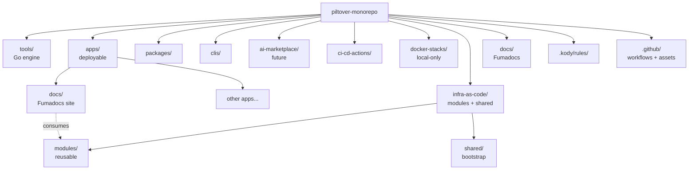
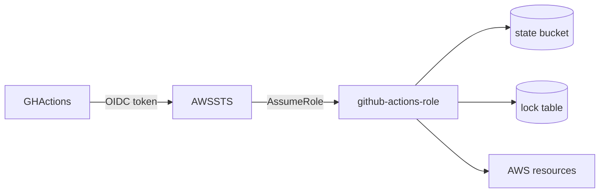
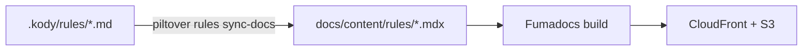
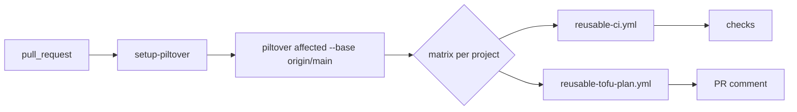
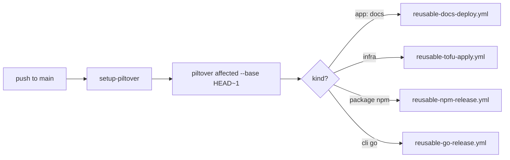

# Piltover Monorepo — Foundation Design

> **Status:** Approved during brainstorming, 2026-04-29.
> **Scope:** Foundation only. Each major subsystem (first CLI, first npm package, first
> mini-app, first Lambda, MCP servers, etc.) becomes a separate child spec after the
> foundation is in place.

---

## 1. Goal

Build a **single public GitHub repository** that serves as the home for **every**
software artifact a solo full-stack maker (focused on AI and SRE) ships: reusable
GitHub Actions, custom plugins, IDE/agent rules, polyglot packages and CLIs, mini-apps
(frontend and backend), local docker-compose stacks, and modern markdown
documentation.

The repository is **not** a strict monorepo. It is a **polyrepo-in-one-folder** with a
**thin shared layer** that standardizes lint, test, CI, and project discovery — without
forcing every subproject into a single build graph.

---

## 2. Core Principles

1. **Vendor-native first.** Use what each ecosystem already offers (Conventional Commits,
   Kody Rules, Fumadocs, OpenTofu, GitHub Actions). Do not invent new formats.
2. **Thin abstractions, zero hidden magic.** The custom engine wraps native tools and
   **always logs the underlying command** before executing.
3. **YAGNI.** No build-graph caching, no remote execution, no marketplace transpilers in
   v0. Add only when concrete pain shows up.
4. **OSS without limits.** Apache-2.0 for code, CC-BY-4.0 for docs. Every dependency
   chosen must be free of paid tiers for core use.
5. **Public-first.** Repo is public from day 1. Secrets only via AWS OIDC + IAM.
6. **AWS-maximalist.** Default cloud is AWS. Hosting, storage, IaC backend, queues — all
   AWS unless a strong reason to deviate.
7. **Subprojects nearly autonomous.** Each project owns its `project.yaml`, its
   toolchain commands, and (where applicable) its `infra/`.

---

## 3. Top-Level Repository Layout

```
/
├── README.md                       Banner (SVG) + tagline + tables + quickstart (EN)
├── AGENTS.md                       Source of truth for every coding agent
├── CLAUDE.md                       @AGENTS.md + Claude-specific overrides
├── LICENSE                         Apache-2.0
├── NOTICE                          (created when first dependency demands it)
├── Makefile                        Bootstrap: `make tools`, `make ci`
├── lefthook.yml                    Git hooks (lint staged, commitlint)
├── commitlint.config.cjs           Conventional Commits config
│
├── tools/                          Custom engine (Go) — see §4
│   ├── cmd/piltover/
│   ├── internal/
│   ├── templates/
│   ├── configs/                    Shared lint/format configs (biome, golangci, ruff)
│   └── go.mod
│
├── apps/                           Deployable mini-apps (web, backend services)
│   └── docs/                       Fumadocs site — see §7
│
├── packages/                       Publishable libs (npm, pypi, cargo, go mod)
├── clis/                           Standalone CLIs (Go preferred)
├── ai-marketplace/                 (Reserved for future multi-target plugins; empty in MVP)
│
├── ci-cd-actions/                  GitHub Composite Actions (reusable steps)
├── docker-stacks/                  Local-only docker-compose stacks — see §8
│
├── infra-as-code/                  Shared OpenTofu — see §6
│   ├── modules/                    Reusable child modules
│   ├── shared/                     One-off bootstrap stacks (OIDC, ECR, route53)
│   └── README.md
│
├── docs/                           Fumadocs Next.js app + content — see §7
│   └── superpowers/specs/          Brainstorm specs (this file lives here)
│
├── .kody/
│   └── rules/                      Kody Custom Rules (.md + frontmatter) — see §5
│
└── .github/
    ├── workflows/                  Reusable workflows + entry-points (pr, main, nightly)
    └── assets/banner.svg           Repo banner used by README
```



---

## 4. The `piltover` Engine

### 4.1 Language and binary

- Written in **Go** (≥ 1.23). Single binary, no runtime dependencies.
- Source under `tools/cmd/piltover/`. Internal packages under `tools/internal/`.
- Bootstrapped via `make tools` (runs `go install ./tools/cmd/piltover` into
  `$(go env GOBIN)`). Binary is **not committed** to git.

### 4.2 Discovery via `project.yaml`

Every subproject (anywhere under `apps/`, `packages/`, `clis/`, `docker-stacks/`,
`ci-cd-actions/`, `infra-as-code/modules/*`, `docs/`, etc.) contains a `project.yaml`
at its root:

```yaml
name: piltover-docs
kind: app                       # app | package | cli | plugin | action | stack | infra-module
language: ts                    # go | ts | python | rust | shell | hcl | none
tags: [docs, public]
commands:                       # optional overrides; defaults derive from `language`
  lint: bun run lint
  test: bun run test
  build: bun run build
release:
  strategy: none                # changesets | goreleaser | pypi-twine | container-only | none
```

Default commands per language live in `tools/configs/defaults.yaml` and are applied
when `commands.*` is unset.

### 4.3 Command surface (v0)

| Command | Behavior |
|---|---|
| `piltover ls` | List every discovered subproject with kind / language / tags. |
| `piltover lint [paths...]` | Run lint for affected (or specified) projects. |
| `piltover test [paths...]` | Run tests. |
| `piltover build [paths...]` | Run build. |
| `piltover ci` | Run lint + test + build with JSON-friendly output for GH Actions. |
| `piltover affected --base <ref>` | Emit JSON matrix of projects touched since `<ref>`. |
| `piltover new <kind> <name>` | Scaffold from `tools/templates/<kind>/`. |
| `piltover doctor [--json] [--fix]` | Verify required toolchains — see §4.6. |
| `piltover tf <target> <action>` | Wrap `tofu` with backend config (state in S3, lock in DynamoDB). |
| `piltover stacks ls\|up\|down\|nuke <name>` | Wrap `docker compose` for `docker-stacks/*`. |
| `piltover rules ls\|lint\|sync-docs` | List Kody rules, validate frontmatter, regenerate `docs/content/rules/*.mdx` from `.kody/rules/*.md`. |

### 4.4 Logging principle (HARD requirement)

Before invoking any external command, `piltover` writes to **stderr** in this exact
shape:

```
→ [<project-relative-path>] $ <full command with args>
```

- Default level: every external invocation logged.
- `--verbose` / `-v`: also logs relevant environment variables.
- `--quiet`: suppresses the `→` lines (still passes through subcommand stdout/stderr).
- `--dry-run`: prints the lines and exits without executing anything.

Rationale: a developer or agent must always be able to copy the logged command and run
it directly to debug without the engine in the loop. This is documented in `AGENTS.md`.

### 4.5 What the engine does NOT do (v0)

- No build-graph cache (local or remote).
- No dependency resolution between subprojects.
- No remote execution.
- No publish to npm/pypi/marketplace inside the engine — done by per-language CI
  workflows (changesets, goreleaser, twine).

### 4.6 `piltover doctor`

Checks required toolchains and prints a coloured report (or JSON with `--json`).
Day-1 checks:

| Check | Purpose | Threshold |
|---|---|---|
| `go` | Engine + Go CLIs/apps | ≥ 1.23 |
| `node` | TS apps, packages, opencode plugins | ≥ 22 |
| `bun` | Optional fast TS runner | any (optional) |
| `python` + `uv` | Python libs and Lambdas | py ≥ 3.12, uv ≥ 0.4 |
| `tofu` | IaC | ≥ 1.8 |
| `docker` | Local stacks, OCI builds | engine running |
| `git` | Required everywhere | ≥ 2.40 |
| `lefthook` | Hooks | any |
| `aws` | Optional; needed to apply IaC | any (optional) |
| `gh` | Optional; PR helpers | any (optional) |
| AWS connectivity | `aws sts get-caller-identity` | optional, skippable |

`piltover doctor --fix` (post-MVP) prints suggested install commands per OS but never
auto-installs without `-y`. Documented in `docs/content/repo/doctor.mdx` with version
thresholds, install links per OS, and what each missing tool blocks.

---

## 5. Agent / IDE / Reviewer Compatibility Surface

The repo exposes only **three** surfaces to the broader agent/IDE ecosystem:

1. **Fumadocs site** (`/docs/`) — humans browse the catalogue and copy-paste install
   instructions.
2. **`AGENTS.md`** — root file, agnostic instructions for any coding agent that respects
   the convention (Codex, Aider, Claude Code via `@AGENTS.md`, opencode, Cursor with the
   same convention).
3. **Kody Custom Rules** — markdown files at `.kody/rules/**/*.md` with YAML frontmatter:

   ```yaml
   ---
   title: "Always log underlying commands in tooling wrappers"
   scope: "file"
   path: ["tools/**/*.go", "clis/**/*.go"]
   severity_min: "medium"
   languages: ["go"]
   buckets: ["style-conventions"]
   enabled: true
   ---
   ```

The MVP **explicitly excludes** Claude Code marketplaces, Cursor team marketplaces,
opencode npm distribution, and any cross-target plugin transpiler. The
`/ai-marketplace/` folder exists as a reserved name but is empty in v0 (contains only a
`README.md` describing future scope).

`AGENTS.md` outline (sections, in EN):
1. What this repo is (3 lines)
2. Repo layout (table)
3. The `piltover` engine (key commands + logging convention)
4. How to add X (app / cli / package / rule / docker-stack / IaC module / GH action)
5. Conventions (commits, branches, AWS OIDC, secret hygiene, "log everything")
6. Per-language toolchain commands (canonical)
7. Don'ts (no prod in docker-compose, no AWS keys in secrets, no `cd` in scripts)

`CLAUDE.md` content:

```markdown
@AGENTS.md

# Claude-specific overrides

- Use the piltover engine for all repo-aware operations.
- When unsure of a path, run `piltover ls`.
```

---

## 6. Infrastructure as Code — OpenTofu

### 6.1 Layout

```
infra-as-code/
├── modules/                       Reusable child modules, version-tagged
│   ├── s3-static-site/            CloudFront + ACM + Route53 + S3
│   ├── ecs-service/
│   ├── lambda-fn/
│   ├── ecr-repo/
│   ├── iam-role-template/
│   ├── dynamodb-table/
│   └── README.md                  Module catalogue
├── shared/                        Apply-once bootstrap stacks
│   ├── account-bootstrap/
│   ├── github-oidc-provider/      AWS IAM role assumed by GH Actions
│   ├── route53-zones/
│   └── ecr-shared/
└── README.md
```

Apps consume modules from `apps/<name>/infra/` (root module per app):

```hcl
module "site" {
  source = "../../../infra-as-code/modules/s3-static-site?ref=infra-modules/s3-static-site/v0.1.0"
  ...
}
```

Module versioning is via git tags of the form `infra-modules/<name>/v<semver>`.

### 6.2 State backend

S3 (state) + DynamoDB (lock). Backend bootstrap is part of `shared/account-bootstrap/`
and applied manually exactly once per AWS account. The `piltover tf` wrapper auto-fills
backend config based on the project path.

### 6.3 GitHub OIDC

CI authenticates to AWS via OIDC + assume-role. **No `AWS_ACCESS_KEY_ID` ever lives in
GitHub Secrets.** Documented as a hard rule in `AGENTS.md`. The role is created by
`shared/github-oidc-provider/`.



---

## 7. Documentation — Fumadocs

### 7.1 Why Fumadocs

MIT, OSS, no SaaS quota; runs on Next.js App Router; MDX-first with native components
and built-in search (Orama local). Mintlify (paywall), Nextra (less polished for
catalogues), Docusaurus (heavier, weaker MDX), Starlight (adds Astro outside our stack)
were considered and rejected.

### 7.2 Layout

```
docs/                              Top-level (NOT under apps/) — special by design
├── app/                           Next App Router
├── content/
│   ├── index.mdx
│   ├── repo/
│   │   ├── structure.mdx          Mirrors AGENTS.md visually
│   │   ├── engine.mdx             piltover CLI documentation
│   │   ├── doctor.mdx             Per-toolchain install + thresholds + blocked features
│   │   └── conventions.mdx
│   ├── rules/
│   │   └── [...slug].mdx          Generated from .kody/rules/*.md (1:1 mapping)
│   ├── guides/
│   │   ├── getting-started.mdx
│   │   ├── adding-an-app.mdx
│   │   ├── adding-a-cli.mdx
│   │   └── adding-a-rule.mdx
│   └── meta.json
├── public/
├── source.config.ts
├── next.config.mjs
├── tailwind.config.ts
├── package.json
├── infra/                         OpenTofu root for hosting
└── project.yaml                   kind: app, language: ts
```

Mermaid is enabled via remark plugin; pages with diagrams: `repo/structure.mdx`,
`repo/engine.mdx`, `guides/getting-started.mdx`.

### 7.3 Rules → Docs sync

`.kody/rules/*.md` is the single source of truth. `piltover rules sync-docs`:

- Reads each `.kody/rules/<slug>.md`.
- Writes `docs/content/rules/<slug>.mdx` with Fumadocs frontmatter (`title`,
  `description`) and a header block displaying the Kody fields (scope, severity, paths,
  languages, buckets, enabled), followed by the rule body.
- Runs in a lefthook pre-commit hook on changes under `.kody/rules/**`.



### 7.4 Hosting — GitHub Pages (revised 2026-05-02)

**Decision (revised):** the docs site hosts on **GitHub Pages**, not S3 + CloudFront.

`next build` with `output: 'export'` → static assets uploaded via
`actions/upload-pages-artifact@v3` and deployed by `actions/deploy-pages@v4`. Custom
domain (optional) configured via a `CNAME` file in `docs/public/`. HTTPS is automatic
(Let's Encrypt). Deploy runs on every merge to `main` via
`.github/workflows/reusable-docs-deploy.yml`.

**Why the revision (vs the original AWS-maximalist plan):**

- Cost: free vs ~$1-5/month for CloudFront + S3 + Route53.
- Setup: zero infrastructure vs OpenTofu module + OIDC + state backend + ACM cert.
- Decouples Plan 3 from Plan 4 (no longer blocks on OpenTofu modules existing).
- The docs site has no runtime needs (pure static), so the AWS-maximalist principle
  pays for nothing concrete here.
- Migration path stays open: Fumadocs `output: 'export'` is portable. If a future
  need (private docs, custom edge logic, A/B tests) demands moving off Pages,
  swapping the deploy step is the only change.

**The AWS-maximalist principle (§2 item 6) still applies to everything else** —
mini-apps, queues, lambdas, blob storage, IaC backend. GitHub Pages is a single,
scoped exception for the documentation site.

The unused `infra-as-code/modules/s3-static-site/` module remains available in the
catalogue for any future static site that needs CloudFront-grade edge controls.

---

## 8. Local-Only Docker Stacks

`/docker-stacks/<name>/compose.yaml` — one self-contained compose file per stack. Each
stack folder has:
- `compose.yaml` (modern format; not `docker-compose.yml`)
- `.env.example` (versioned), `.env` (gitignored)
- `README.md`: what's inside, ports, default credentials, connection snippet

MVP stacks: `postgres/` and `localstack/`. Future: `redis-stack/`, `observability/`
(otel + prometheus + grafana + loki), `ai-local/` (ollama + open-webui),
`kafka-redpanda/`.

**Hard rule:** none of these are production-grade. Production runs on AWS via OpenTofu.
Documented in `AGENTS.md`.

---

## 9. CI/CD — GitHub Actions

### 9.1 Layout

```
.github/workflows/                 Reusable workflows + entry-points
├── pr.yml                         Entry: pull_request
├── main.yml                       Entry: push to main
├── nightly.yml                    Entry: schedule (drift detection)
├── reusable-ci.yml                lint + test + build, parametrised by project_path
├── reusable-tofu-plan.yml         OpenTofu plan + PR comment
├── reusable-tofu-apply.yml        OpenTofu apply via OIDC (main only)
├── reusable-go-release.yml        goreleaser
├── reusable-npm-release.yml       changesets
└── reusable-docs-deploy.yml       Static export → S3 sync → CloudFront invalidation

ci-cd-actions/                     Composite actions (reusable steps)
├── setup-piltover/                Builds/caches the engine
├── setup-go-cached/
├── setup-node-cached/
├── setup-tofu-aws-oidc/           Assumes role, configures backend
├── piltover-affected/             Runs `piltover affected --base $BEFORE`, emits matrix
└── docker-buildx-ecr-push/
```

### 9.2 PR flow



### 9.3 main flow



---

## 10. Conventions

| Topic | Decision |
|---|---|
| Commits | Conventional Commits, validated by `commitlint` via `lefthook` |
| Branches | Short-lived feature branches; `main` is protected |
| Merges | **Squash-merge only** |
| Hooks | `lefthook` (Go binary, no Node deps) |
| Lint (TS) | `biome` |
| Lint (Go) | `golangci-lint` |
| Lint (Python) | `ruff` |
| Lint (HCL) | `tflint` + `tofu fmt` |
| Lint (shell) | `shellcheck` |
| Test (TS) | `vitest` (or framework-native for Next) |
| Test (Go) | `go test` |
| Test (Python) | `pytest` |
| Release (TS package) | `changesets` |
| Release (Go CLI) | `goreleaser` |
| Release (Python lib) | `uv build` + `twine` |
| Release (infra module) | git tag `infra-modules/<name>/v<semver>` |
| Secrets | AWS OIDC + IAM only; no static keys in GH Secrets |
| README/docs language | English |
| License (code) | Apache-2.0 |
| License (docs/content) | CC-BY-4.0 |

---

## 11. README.md (root)

Required sections, in this order:
1. **Banner** — `<.github/assets/banner.svg>` (hand-authored monolinha SVG, "Piltover"
   wordmark + circuit/node motif). Raster generated by AI is a post-MVP nice-to-have.
2. **Tagline:** *"A polyglot workshop for AI, SRE, and side projects — engineered as a
   thin-layer monorepo."*
3. **Badges:** license (Apache-2.0), CI status (`pr.yml`), docs site link, last release.
4. **What's inside** — table mapping top-level folders to one-line descriptions.
5. **Quickstart** — `make tools` → `piltover doctor` → `piltover ls` → link to
   `/docs/guides/getting-started`.
6. **Status & roadmap** — link to a GitHub Project board.
7. **License** — Apache-2.0 + CC-BY-4.0 note.

Language: English.

---

## 12. MVP Deliverables

The MVP for this foundation spec produces a repo where:

1. Top-level layout exists with `.gitkeep` + minimal README in every empty top-level
   folder.
2. `AGENTS.md`, `CLAUDE.md`, `README.md` (with banner SVG), `LICENSE` (Apache-2.0),
   `Makefile`.
3. `piltover` v0 implemented with all commands listed in §4.3 plus the logging
   discipline of §4.4.
4. `lefthook.yml`, `commitlint.config.cjs`, base lint configs in `tools/configs/`.
5. `.github/workflows/`: `pr.yml`, `main.yml`, `reusable-ci.yml`, `reusable-docs-deploy.yml`.
6. `.github/assets/banner.svg`.
7. `docs/` Fumadocs scaffold with: `index.mdx`, `repo/structure.mdx`,
   `repo/engine.mdx`, `repo/doctor.mdx`, `guides/getting-started.mdx`,
   `guides/adding-a-rule.mdx`. Mermaid plugin enabled.
8. `.kody/rules/`: at least 2 rules (`always-log-commands.md`,
   `go-style-baseline.md`).
9. `infra-as-code/shared/github-oidc-provider/` — applied manually once.
10. `infra-as-code/modules/s3-static-site/`.
11. `apps/docs/infra/` — OpenTofu root consuming `s3-static-site`.
12. `docker-stacks/postgres/` and `docker-stacks/localstack/` (canonical examples).

---

## 13. Out of Scope (handled by future child specs)

- First Go CLI (template + goreleaser pipeline).
- First npm package (template + changesets pipeline).
- First full-stack mini-app (Next + AWS deploy).
- First Python AWS Lambda.
- Reusable MCP server packages.
- Skill / rule template library expansion.
- Anything inside `/ai-marketplace/` beyond the placeholder README.
- AI-generated raster banner.
- `piltover doctor --fix`.
- Cache for the engine (local or remote).

---

## 14. Open Questions

None for the foundation. Future child specs will surface their own.
